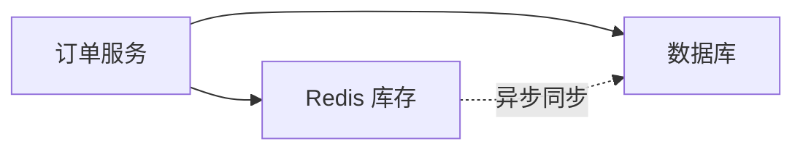

# 📦 Redis Inventory Adapter 使用指南

## 概述

`RedisInventoryAdapter` 是基于 Redis 的高性能库存管理实现，适用于高并发场景。

---

## ✨ 特性

- ✅ **高性能** - 内存操作，毫秒级响应
- ✅ **原子性** - 使用 Lua 脚本保证操作原子性
- ✅ **分布式** - 支持多实例部署
- ✅ **过期时间** - 预留自动过期，防止库存锁死
- ✅ **并发安全** - 支持高并发场景

---

## 📋 安装依赖

```bash
# 安装 Redis Python 客户端
pip install redis

# 或使用 uv
uv add redis
```

---

## 🚀 快速开始

### 1. 启动 Redis

```bash
# 使用 Docker
docker run -d -p 6379:6379 redis:latest

# 或本地安装
redis-server
```

### 2. 配置环境变量

```env
# .env
REDIS_URL=redis://localhost:6379/0
INVENTORY_RESERVATION_TTL=1800  # 预留过期时间（秒）
```

### 3. 使用 Adapter

```python
from contexts.ordering.infrastructure.adapters import RedisInventoryAdapter

# 创建适配器
adapter = RedisInventoryAdapter(
    redis_url="redis://localhost:6379/0",
    reservation_ttl=1800,  # 30分钟
)

# 设置库存
await adapter.set_inventory("PROD_001", 100)

# 检查库存
is_available = await adapter.check_availability("PROD_001", 10)

# 预留库存
from contexts.ordering.domain.ports.services import ReservationRequest
request = ReservationRequest(
    order_id="ORDER_001",
    items=[("PROD_001", 10)]
)
result = await adapter.reserve_inventory(request)

# 扣减库存
await adapter.deduct_inventory("PROD_001", 10)

# 关闭连接
await adapter.close()
```

---

## 🏗️ Redis 数据结构

### 库存数据 (Hash)

**键：** `inventory:{product_id}`

**字段：**
```
available: 100    # 可用数量
reserved: 20      # 预留数量
total: 120        # 总库存
```

### 预留数据 (Hash + TTL)

**键：** `reservation:{reservation_id}`

**字段：**
```
order_id: "ORDER_001"
items: '[["PROD_001", 10], ["PROD_002", 5]]'
```

**TTL：** 1800秒（30分钟）

---

## 🔧 核心功能

### 1. 库存检查

```python
# 单个检查
is_available = await adapter.check_availability("PROD_001", 10)

# 批量检查
results = await adapter.check_availability_batch([
    ("PROD_001", 10),
    ("PROD_002", 5),
])
# returns: {"PROD_001": True, "PROD_002": False}
```

### 2. 库存预留（原子性）

```python
request = ReservationRequest(
    order_id="ORDER_001",
    items=[("PROD_001", 10), ("PROD_002", 5)]
)

result = await adapter.reserve_inventory(request)

if result.success:
    print(f"预留成功: {result.reservation_id}")
    # 预留会在 30 分钟后自动过期
else:
    print(f"预留失败: {result.failed_items}")
```

**Lua 脚本保证原子性：**
```lua
-- 1. 检查所有商品库存
-- 2. 如果任一商品库存不足，整个预留失败
-- 3. 如果都充足，原子性扣减可用库存，增加预留库存
```

### 3. 释放预留

```python
# 释放预留（恢复库存）
success = await adapter.release_reservation(reservation_id)
```

### 4. 扣减库存（原子性）

```python
# 优先从预留库存扣减
success = await adapter.deduct_inventory("PROD_001", 10)
```

**Lua 脚本逻辑：**
```lua
-- 1. 检查总库存（available + reserved）是否充足
-- 2. 优先从 reserved 扣减
-- 3. 不足时从 available 扣减
-- 4. 原子性更新 available, reserved, total
```

### 5. 恢复库存

```python
# 退款或取消订单时恢复库存
await adapter.restore_inventory("PROD_001", 10)
```

---

## 🔄 从数据库同步

```python
# 从数据库批量同步库存到 Redis
inventories = {
    "PROD_001": 500,
    "PROD_002": 300,
    "PROD_003": 150,
}

await adapter.sync_from_database(inventories)
```

**使用场景：**
- 系统启动时初始化 Redis
- 定时同步数据库库存到 Redis
- 数据库库存变更后更新 Redis

---

## 🧪 测试

```bash
# 运行测试
uv run python tests/ordering/test_redis_inventory_adapter.py
```

**测试内容：**
- ✅ 基本操作（设置、获取、检查）
- ✅ 库存预留和释放
- ✅ 扣减和恢复
- ✅ 并发操作（原子性验证）
- ✅ 数据库同步

---

## 🎯 使用 Adapter Factory

```python
from contexts.ordering.infrastructure.adapters import AdapterFactory

# 配置 REDIS_URL 后自动使用 Redis Adapter
factory = AdapterFactory(session)
inventory = factory.get_inventory_adapter()

# 在生产环境且配置了 REDIS_URL 时，会自动使用 RedisInventoryAdapter
# 否则降级为 LocalInventoryAdapter
```

---

## 💡 最佳实践

### 1. 预留过期时间

```python
# 根据业务设置合理的过期时间
adapter = RedisInventoryAdapter(
    redis_url="...",
    reservation_ttl=1800,  # 30分钟：用户下单到支付的时间
)
```

### 2. 双写策略（推荐）



**优势：**
- Redis 提供高性能查询和扣减
- 数据库作为持久化存储
- 异步同步保证数据一致性

### 3. 定时同步

```python
# 每小时从数据库同步到 Redis
import asyncio

async def sync_inventory_periodically():
    while True:
        try:
            # 从数据库获取库存
            inventories = await fetch_inventories_from_db()

            # 同步到 Redis
            await redis_adapter.sync_from_database(inventories)

            print("✅ Inventory synced")
        except Exception as e:
            print(f"❌ Sync failed: {e}")

        # 每小时执行一次
        await asyncio.sleep(3600)
```

### 4. 监控和告警

```python
# 监控库存低于阈值
async def check_low_inventory():
    products = await get_all_product_ids()

    for product_id in products:
        inventory = await redis_adapter.get_inventory(product_id)

        if inventory.available_quantity < 10:
            # 发送告警
            await send_alert(f"Low inventory: {product_id}")
```

---

## 🔥 高并发场景

### 性能对比

| Adapter | QPS | 并发数 | 响应时间 |
|---------|-----|--------|----------|
| LocalInventoryAdapter | ~1,000 | 低 | 10-50ms |
| RedisInventoryAdapter | ~10,000+ | 高 | 1-5ms |

### 并发测试

```python
# 测试 1000 个并发预留
import asyncio

tasks = []
for i in range(1000):
    request = ReservationRequest(
        order_id=f"ORDER_{i}",
        items=[("PROD_001", 1)]
    )
    tasks.append(adapter.reserve_inventory(request))

results = await asyncio.gather(*tasks)
```

**Lua 脚本保证：**
- ✅ 不会超卖
- ✅ 操作原子性
- ✅ 高性能

---

## 🚨 注意事项

### 1. Redis 宕机

```python
# 使用 try-except 处理 Redis 错误
try:
    result = await redis_adapter.reserve_inventory(request)
except Exception as e:
    # 降级到数据库
    result = await local_adapter.reserve_inventory(request)
```

### 2. 数据一致性

- Redis 是缓存层，数据库是主数据源
- 定期从数据库同步到 Redis
- 关键操作（支付）需要写入数据库

### 3. 预留过期

- 预留自动过期后库存自动释放
- 如果订单支付，需要手动 `release_reservation`
- 或者直接 `deduct_inventory`（优先从预留扣减）

---

## 📊 优势总结

| 特性 | LocalInventoryAdapter | RedisInventoryAdapter |
|-----|----------------------|----------------------|
| **性能** | ⭐⭐⭐ | ⭐⭐⭐⭐⭐ |
| **并发** | 低 | 高 |
| **分布式** | ❌ | ✅ |
| **过期时间** | ❌ | ✅ |
| **部署复杂度** | 简单 | 中等 |
| **适用场景** | 小规模 | 大规模高并发 |

---

## 🎯 何时使用

### 使用 LocalInventoryAdapter

- ✅ 订单量 < 1000/天
- ✅ 单机部署
- ✅ 简单场景

### 使用 RedisInventoryAdapter

- ✅ 订单量 > 10000/天
- ✅ 分布式部署
- ✅ 高并发场景（如秒杀）
- ✅ 需要预留过期功能

---

## 📚 参考文档

- Redis 官方文档：https://redis.io/documentation
- redis-py 文档：https://redis-py.readthedocs.io/
- Lua 脚本教程：https://redis.io/docs/manual/programmability/

---

**RedisInventoryAdapter 已生产就绪！** 🚀

适用于大规模、高并发的库存管理场景。
