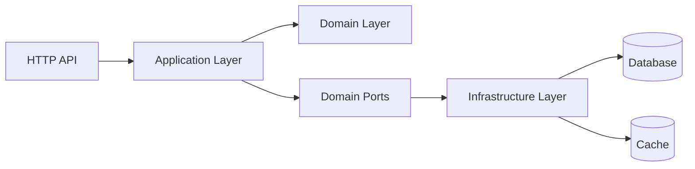
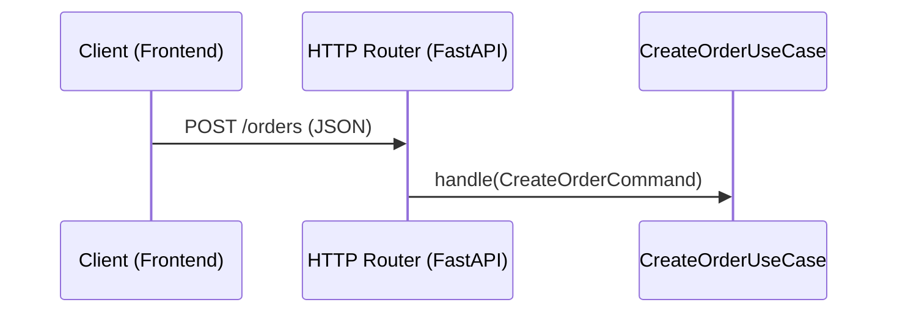
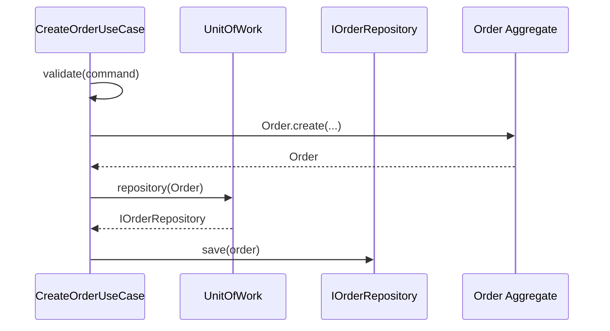
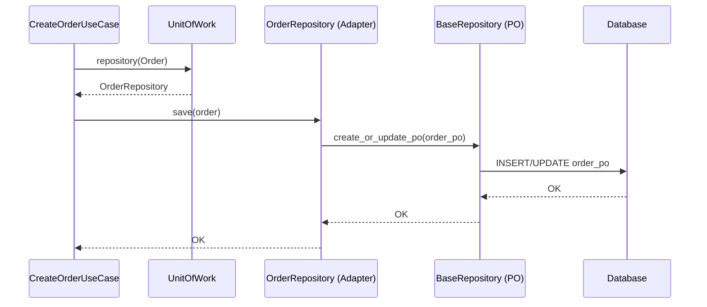
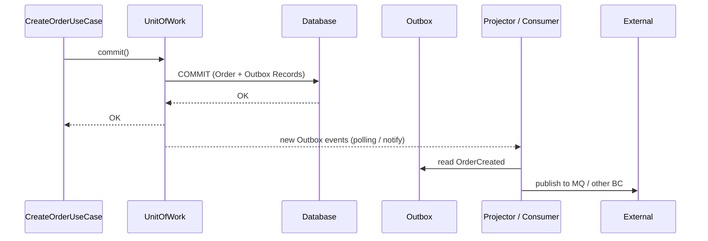

# My‑Shop 下单流程端到端架构

本文档说明 my‑shop 中“创建订单（下单）”的端到端调用链，以及它如何体现 Bento Framework 的 DDD + 六边形架构设计思想。

---

## 1. 分层总览（Hexagonal 视角）



- **UI 层**：HTTP 入口（FastAPI），只负责协议适配（JSON ↔ DTO），不包含业务逻辑。
- **Application 层**：应用服务/UseCase，负责编排业务流程，依赖 `UoW` 与 `IRepository` 端口。
- **Domain 层**：聚合根（`Order`）、实体与值对象，包含核心业务规则，不依赖任何技术栈。
- **Ports（端口）**：`IOrderRepository`, `IUoW` 等接口，定义 Domain 需要的能力。
- **Infrastructure 层**：`OrderRepository(RepositoryAdapter)`、数据库访问、缓存、Outbox 等适配器。
- **外部资源**：数据库、缓存、消息系统等，由适配器对接。

分层依赖关系：

```text
Domain  →  Ports  ←  Application
                     ↓
               Infrastructure  →  DB / Cache / MQ
```

---

## 2. 业务场景：创建订单（下单）

### 2.1 HTTP 入口（Interfaces 层）

- 典型路由：`POST /orders`
- 职责：
  - 解析 HTTP 请求体为 `CreateOrderRequestDTO`。
  - 通过 DI 获取 `CreateOrderUseCase`。
  - 将 DTO 转换为 `CreateOrderCommand`，调用 UseCase 的 `handle()`。



> 注意：路由层不直接操作仓储 / DB，只负责 DTO ↔ Command 转换与调用 UseCase。

---

### 2.2 Application 层：CreateOrderUseCase

- 责任：
  - 校验命令（参数合法性、业务前置条件）。
  - 调用 Domain 构造 `Order` 聚合根（从 Command/DTO 映射）。
  - 通过 `UoW.repository(Order)` 获取 `IOrderRepository` 实例。
  - 调用仓储 `save(order)` 持久化。
  - 在上层（通常是应用服务或中间件）统一提交 UoW 事务。

伪代码结构（与 `CreateCategoryCommandHandler` 类似）：

```python
class CreateOrderUseCase:
    def __init__(self, uow: UnitOfWork):
        self.uow = uow

    async def validate(self, command: CreateOrderCommand) -> None:
        # 参数校验（示例）
        if not command.items:
            raise ApplicationException(...)

    async def handle(self, command: CreateOrderCommand) -> Order:
        await self.validate(command)

        # 1. 构造聚合根
        order = Order.create(
            customer_id=ID(command.customer_id),
            items=[...],
            address=...,  # 值对象
        )

        # 2. 持久化
        order_repo = self.uow.repository(Order)
        await order_repo.save(order)

        # 3. 返回聚合根（或 DTO）
        return order
```

在调用链中：



---

### 2.3 Domain 层：Order 聚合根

- 典型职责：
  - 通过工厂/构造函数保证不变量（例如：订单至少有一个明细、金额非负）。
  - 提供行为方法（`add_item`, `calculate_total`, `mark_submitted` 等）。
  - 可产生领域事件（`OrderCreated`, `OrderPaid`）。

Domain 层只关心**业务语义**，不感知：
- 数据库
- 缓存
- HTTP

示例结构：

```python
class Order(AggregateRoot):
    @classmethod
    def create(cls, customer_id: ID, items: list[OrderItem], address: Address) -> "Order":
        if not items:
            raise DomainException("Order must have at least one item")
        order_id = ID.generate()
        order = cls(id=order_id, customer_id=customer_id, items=items, address=address)
        order.calculate_total()
        # 这里也可以记录领域事件 OrderCreated
        return order

    def mark_submitted(self) -> None:
        if self.status != OrderStatus.DRAFT:
            raise DomainException("Only draft orders can be submitted")
        self.status = OrderStatus.SUBMITTED
```

---

### 2.4 Repository 端口与适配器

#### 2.4.1 端口（Port）：IOrderRepository

- 文件位置（示意）：
  - `applications/my-shop/contexts/ordering/domain/ports/repositories/i_order_repository.py`
- 定义：
  - 继承框架的 `IRepository[Order, OrderID]`，
  - 可增加订单特有的查询方法（例如按客户、按状态筛选）。

#### 2.4.2 适配器（Adapter）：OrderRepository

- 文件位置（示意）：
  - `applications/my-shop/contexts/ordering/infrastructure/repositories/order_repository_impl.py`
- 结构：
  - 继承 `RepositoryAdapter[Order, OrderPO, OrderID]`。
  - 使用 Mapper 进行 AR ↔ PO 转换。
  - 内部委托给 `BaseRepository` 执行 SQLAlchemy 操作。

调用链：



> Application 层只看到 `IOrderRepository` 接口，不直接接触 SQLAlchemy / Session。

---

### 2.5 UoW + Outbox：事务与跨上下文集成

- **UnitOfWork**：
  - 维护数据库事务（Begin / Commit / Rollback）。
  - 聚合多个仓储操作，保证在同一事务中完成。

- **Outbox 模式**：
  - 在提交事务时，将聚合根产生的领域事件写入 Outbox 表。
  - 独立的 Projector 监听 Outbox 表变化，将事件投递到下游（其他 BC / 外部系统）。

时序示意：



这样保证：
- 订单写库和事件写 Outbox **在同一事务中**，避免“订单存在但事件丢失”的不一致。
- 对下游来说，事件是可靠的、可重放的。

---

## 3. Cache 在下单流程中的角色

在下单主链路中，Cache 通常用于：
- 读取商品/库存快照
- 读取用户/地址信息缓存

Bento 中 Cache 的设计：
- `CacheConfig`：缓存配置 Value Object（backend、ttl、redis_url 等）。
- `MemoryCache` / `RedisCache`：实现缓存端口，统一通过 `CacheSerializer` 序列化聚合根。
- `AggregateRoot.to_cache_dict()`：提供默认的可缓存表示，应用层可以覆盖。

特点：
- Application 和 Domain **不关心**缓存细节，只是通过端口读取数据。
- Cache 的序列化在框架层统一处理，减少应用层重复代码。

---

## 4. 该流程如何体现 DDD 与六边形架构

### 4.1 DDD

- **聚合根为中心**：Order 聚合根负责业务规则，仓储以 AR 为粒度持久化。
- **领域服务/应用服务分离**：CreateOrderUseCase 作为应用服务，只做编排，不承载复杂领域规则。
- **领域事件**：订单创建可以产生 `OrderCreated` 等事件，由 Outbox/Projector 处理跨上下文通信。

### 4.2 六边形架构（Ports & Adapters）

- **Ports（端口）**：`IOrderRepository`, `IUoW` 等定义在 Domain/Application 层。
- **Adapters（适配器）**：`OrderRepository`, `MemoryCache`, `RedisCache`, DB Session, Outbox Listener 都在 Infrastructure 层实现。
- **独立的外部世界**：HTTP, DB, Cache, MQ 都通过适配器接入，不污染内核模型。

### 4.3 依赖反转

- Domain 不依赖任何技术细节。
- Application 依赖抽象端口，不依赖具体实现。
- Infrastructure 依赖 Domain 的端口与模型，实现具体技术。

---

## 5. 总结

my‑shop 的下单流程体现了：

1. **清晰的分层结构**：UI / Application / Domain / Infrastructure 职责分明。
2. **DDD 原则**：聚合根、仓储、领域事件、UoW 等模式一应俱全。
3. **六边形架构**：通过 Ports & Adapters 解耦业务与技术实现。
4. **可扩展性**：
   - 可以替换数据库实现（只需实现新的 RepositoryAdapter）。
   - 可以替换缓存实现（Memory ↔ Redis），不影响 UseCase。
   - 可以为事件添加新的投递通道（新 Projector）。

这使得 my‑shop 不仅是一个示例应用，也是理解 Bento Framework 架构思想的“活教材”。
