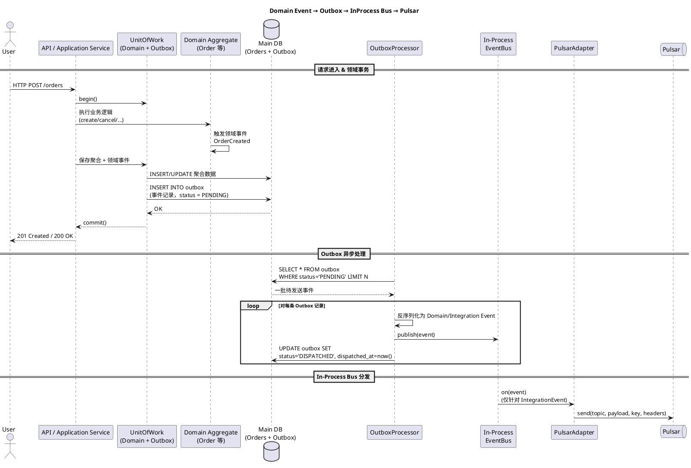
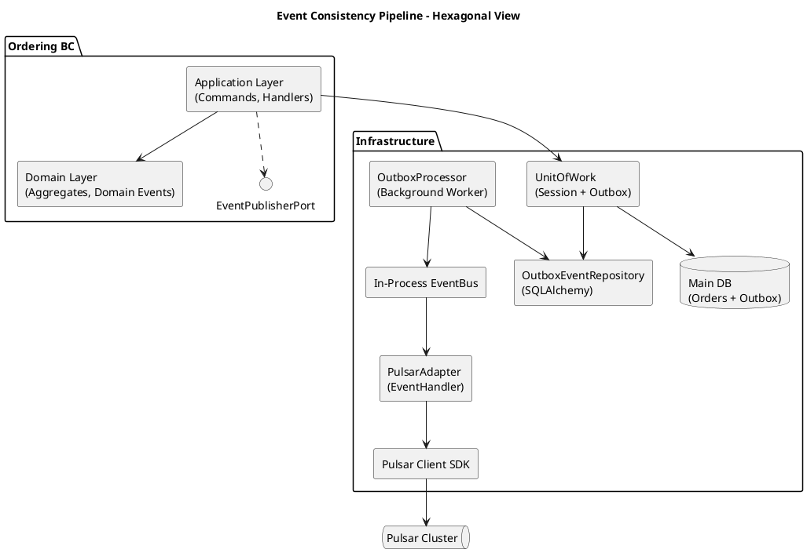

好，我们一步到位，把你要的四块都给全：

1. 全链路时序图
2. Outbox 表结构
3. 架构图（组件关系）
4. FastAPI + SQLAlchemy + Pulsar 的代码骨架（含 Domain Event / Outbox Processor / EventBus / PulsarAdapter）

---

## 1. 全链路时序图（PlantUML）

场景：业务调用 Command → 修改聚合 → 生成领域事件 → 落库 + Outbox → Outbox Processor → In-Process EventBus → Pulsar Adapter → Pulsar




> 说明：
>
> * 本地 EventHandler（如写本地投影、写日志）可以直接订阅 `Bus`，和 PulsarAdapter 一样是 Handler。
> * PulsarAdapter 只负责“将被标记为 IntegrationEvent 的事件”发到 Pulsar。

---

## 2. Outbox 表结构设计

目标：支持多类型事件、幂等、重试、Tracing、分区键。

### 2.1 推荐 Outbox 表结构

```sql
CREATE TABLE outbox_events (
    id              BIGINT PRIMARY KEY AUTO_INCREMENT,
    aggregate_type  VARCHAR(100)   NOT NULL,   -- Order / Shipment / ...
    aggregate_id    VARCHAR(100)   NOT NULL,
    event_type      VARCHAR(200)   NOT NULL,   -- 领域事件/集成事件类型名
    payload         JSON           NOT NULL,   -- 事件数据序列化
    headers         JSON           NULL,       -- trace_id, tenant_id 等元数据

    occurred_at     TIMESTAMP(6)   NOT NULL,   -- 领域事件发生时间
    created_at      TIMESTAMP(6)   NOT NULL DEFAULT CURRENT_TIMESTAMP(6),
    dispatched_at   TIMESTAMP(6)   NULL,       -- 已分发到 in-process bus 的时间
    status          VARCHAR(20)    NOT NULL,   -- PENDING / DISPATCHED / FAILED

    deliver_attempts INT          NOT NULL DEFAULT 0,
    last_error      TEXT           NULL,

    partition_key   VARCHAR(200)   NULL,       -- 用于 Pulsar/Kafka 分区的一致性键
    trace_id        VARCHAR(100)   NULL,
    tenant_id       VARCHAR(64)    NULL
);

CREATE INDEX idx_outbox_status_created
    ON outbox_events(status, created_at);

CREATE INDEX idx_outbox_agg
    ON outbox_events(aggregate_type, aggregate_id);
```

状态流转：

* `PENDING`：刚写入，等待 Processor 处理
* `DISPATCHED`：已经发布到 In-Process Bus（正常路径）
* `FAILED`：多次重试失败，可由运维/定时任务做人工/半自动处理

---

## 3. 架构图（组件关系 / 六边形视角）

用组件图表达：Domain & Application 只“认识” Port（EventPublisherPort），Outbox + Bus + Pulsar 都是 Infrastructure。
@startuml
title Event Consistency Pipeline - Hexagonal View

skinparam componentStyle rectangle

package "Ordering BC" {
  [Application Layer\n(Commands, Handlers)] as App
  [Domain Layer\n(Aggregates, Domain Events)] as Domain

  interface EventPublisherPort

  App --> Domain
  App ..> EventPublisherPort
}

package "Infrastructure" {
  [OutboxEventRepository\n(SQLAlchemy)] as OutboxRepo
  [UnitOfWork\n(Session + Outbox)] as UoW
  [OutboxProcessor\n(Background Worker)] as OutboxProcessor
  [In-Process EventBus] as EventBus
  [PulsarAdapter\n(EventHandler)] as PulsarAdapter
  [Pulsar Client SDK] as PulsarClient

  database "Main DB\n(Orders + Outbox)" as MainDB
}

queue "Pulsar Cluster" as Pulsar

' 依赖关系
App --> UoW
UoW --> MainDB
UoW --> OutboxRepo

OutboxProcessor --> OutboxRepo
OutboxProcessor --> EventBus

EventBus --> PulsarAdapter
PulsarAdapter --> PulsarClient
PulsarClient --> Pulsar

@enduml




要点：

* `EventPublisherPort` 的默认实现就是 “写入 Outbox 表”。
* `OutboxProcessor` + `EventBus` + `PulsarAdapter` 完成从 Outbox → Pulsar 的全链路。
* 如果未来要加 Kafka / Webhook，只要加新的 Adapter 订阅 EventBus 即可。

---

## 4. 代码骨架（FastAPI + SQLAlchemy + Pulsar）

下面是一个可直接落地的“最小闭环”骨架，你可以按你现有框架做微调。

### 4.1 领域事件基类与示例

```python
# domain/events/base.py
from __future__ import annotations
from dataclasses import dataclass, asdict
from datetime import datetime
from typing import Any, Mapping

@dataclass(frozen=True)
class DomainEvent:
    occurred_at: datetime

    def to_dict(self) -> dict[str, Any]:
        return asdict(self)


# domain/events/order_events.py
from dataclasses import dataclass
from .base import DomainEvent

@dataclass(frozen=True)
class OrderCreated(DomainEvent):
    order_id: str
    customer_id: str
    tenant_id: str
```

聚合里持有 `pending_events`：

```python
# domain/order.py
from typing import List
from datetime import datetime
from .events.order_events import OrderCreated

class Order:
    def __init__(self, id: str, customer_id: str, tenant_id: str) -> None:
        self.id = id
        self.customer_id = customer_id
        self.tenant_id = tenant_id
        self._events: List[DomainEvent] = []

    @classmethod
    def create(cls, id: str, customer_id: str, tenant_id: str) -> "Order":
        order = cls(id=id, customer_id=customer_id, tenant_id=tenant_id)
        order._record_event(
            OrderCreated(
                order_id=id,
                customer_id=customer_id,
                tenant_id=tenant_id,
                occurred_at=datetime.utcnow(),
            )
        )
        return order

    def _record_event(self, event: DomainEvent) -> None:
        self._events.append(event)

    def pull_events(self) -> list[DomainEvent]:
        events = list(self._events)
        self._events.clear()
        return events
```

---

### 4.2 Outbox SQLAlchemy 模型

```python
# infra/models/outbox.py
from __future__ import annotations
from datetime import datetime
from typing import Any, Optional

from sqlalchemy import String, Text, Integer, JSON, TIMESTAMP
from sqlalchemy.orm import Mapped, mapped_column, declarative_base

Base = declarative_base()

class OutboxEvent(Base):
    __tablename__ = "outbox_events"

    id: Mapped[int] = mapped_column(primary_key=True, autoincrement=True)
    aggregate_type: Mapped[str] = mapped_column(String(100))
    aggregate_id: Mapped[str] = mapped_column(String(100))
    event_type: Mapped[str] = mapped_column(String(200))
    payload: Mapped[dict[str, Any]] = mapped_column(JSON)
    headers: Mapped[Optional[dict[str, Any]]] = mapped_column(JSON, nullable=True)

    occurred_at: Mapped[datetime] = mapped_column(TIMESTAMP(timezone=False))
    created_at: Mapped[datetime] = mapped_column(
        TIMESTAMP(timezone=False), default=datetime.utcnow
    )
    dispatched_at: Mapped[Optional[datetime]] = mapped_column(
        TIMESTAMP(timezone=False), nullable=True
    )

    status: Mapped[str] = mapped_column(String(20), default="PENDING")
    deliver_attempts: Mapped[int] = mapped_column(Integer, default=0)
    last_error: Mapped[Optional[str]] = mapped_column(Text, nullable=True)

    partition_key: Mapped[Optional[str]] = mapped_column(String(200), nullable=True)
    trace_id: Mapped[Optional[str]] = mapped_column(String(100), nullable=True)
    tenant_id: Mapped[Optional[str]] = mapped_column(String(64), nullable=True)
```

---

### 4.3 EventPublisherPort 与 UoW 写 Outbox

```python
# application/ports/events.py
from typing import Protocol
from domain.events.base import DomainEvent

class EventPublisherPort(Protocol):
    async def publish(self, event: DomainEvent, *, aggregate_type: str, aggregate_id: str) -> None:
        ...
```

实现：写入 Outbox，而不是直接发到 Pulsar。

```python
# infra/events/outbox_publisher.py
from datetime import datetime
from typing import Any

from sqlalchemy.ext.asyncio import AsyncSession

from application.ports.events import EventPublisherPort
from domain.events.base import DomainEvent
from infra.models.outbox import OutboxEvent

class OutboxEventPublisher(EventPublisherPort):
    def __init__(self, session: AsyncSession) -> None:
        self._session = session

    async def publish(self, event: DomainEvent, *, aggregate_type: str, aggregate_id: str) -> None:
        payload: dict[str, Any] = event.to_dict()
        headers: dict[str, Any] = {}  # trace_id / tenant_id 等可在这里塞

        outbox = OutboxEvent(
            aggregate_type=aggregate_type,
            aggregate_id=aggregate_id,
            event_type=event.__class__.__name__,
            payload=payload,
            headers=headers or None,
            occurred_at=event.occurred_at,
            status="PENDING",
            partition_key=str(aggregate_id),
            tenant_id=payload.get("tenant_id"),
        )
        self._session.add(outbox)
```

在 UoW 里封装一个统一接口（示意）：

```python
# infra/uow.py
from typing import Iterable
from sqlalchemy.ext.asyncio import AsyncSession
from domain.order import Order
from domain.events.base import DomainEvent
from infra.events.outbox_publisher import OutboxEventPublisher

class AsyncUnitOfWork:
    def __init__(self, session: AsyncSession) -> None:
        self.session = session
        self._outbox_publisher = OutboxEventPublisher(session)

    async def __aenter__(self) -> "AsyncUnitOfWork":
        return self

    async def __aexit__(self, exc_type, exc, tb) -> None:
        if exc:
            await self.session.rollback()
        else:
            await self.session.commit()
        await self.session.close()

    async def commit_aggregate(self, agg: Order) -> None:
        # 假设 agg 已经 attach 到 session
        events: Iterable[DomainEvent] = agg.pull_events()
        for event in events:
            await self._outbox_publisher.publish(
                event, aggregate_type=type(agg).__name__, aggregate_id=agg.id
            )
```

---

### 4.4 In-Process EventBus

简单实现一个基于内存的 EventBus，用于 OutboxProcessor 与 PulsarAdapter 之间解耦。

```python
# infra/events/event_bus.py
from collections import defaultdict
from typing import Callable, Type, Dict, List, Any

from domain.events.base import DomainEvent

EventHandler = Callable[[DomainEvent], Any]

class InProcessEventBus:
    def __init__(self) -> None:
        self._handlers: Dict[Type[DomainEvent], List[EventHandler]] = defaultdict(list)

    def subscribe(self, event_type: Type[DomainEvent], handler: EventHandler) -> None:
        self._handlers[event_type].append(handler)

    async def publish(self, event: DomainEvent) -> None:
        for event_type, handlers in self._handlers.items():
            if isinstance(event, event_type):
                for h in handlers:
                    result = h(event)
                    if hasattr(result, "__await__"):  # 支持 async handler
                        await result
```

---

### 4.5 OutboxProcessor（后台任务）

```python
# infra/events/outbox_processor.py
from datetime import datetime
from typing import Type
from sqlalchemy import select
from sqlalchemy.ext.asyncio import AsyncSession

from infra.models.outbox import OutboxEvent
from infra.events.event_bus import InProcessEventBus
from domain.events.base import DomainEvent
from domain.events.order_events import OrderCreated  # 仅示例

EVENT_TYPE_MAP: dict[str, Type[DomainEvent]] = {
    "OrderCreated": OrderCreated,
    # 其他事件类型...
}

class OutboxProcessor:
    def __init__(self, session_factory, bus: InProcessEventBus) -> None:
        self._session_factory = session_factory
        self._bus = bus

    async def run_once(self, batch_size: int = 100) -> None:
        async with self._session_factory() as session:
            stmt = (
                select(OutboxEvent)
                .where(OutboxEvent.status == "PENDING")
                .order_by(OutboxEvent.created_at)
                .limit(batch_size)
            )
            result = await session.execute(stmt)
            rows: list[OutboxEvent] = list(result.scalars())

            for row in rows:
                await self._process_row(session, row)

            await session.commit()

    async def _process_row(self, session: AsyncSession, row: OutboxEvent) -> None:
        row.deliver_attempts += 1
        try:
            event_cls = EVENT_TYPE_MAP.get(row.event_type)
            if not event_cls:
                row.status = "FAILED"
                row.last_error = f"Unknown event_type: {row.event_type}"
                return

            event = event_cls(**row.payload)  # 假设 payload 与 dataclass 字段对齐
            await self._bus.publish(event)

            row.status = "DISPATCHED"
            row.dispatched_at = datetime.utcnow()
        except Exception as ex:  # 可细化
            row.status = "FAILED"
            row.last_error = str(ex)
```

---

### 4.6 PulsarAdapter（订阅 EventBus，将 IntegrationEvent 发到 Pulsar）

假设你用 `pulsar` 官方 Python 客户端（简化示例）：

```python
# infra/events/pulsar_adapter.py
import json
import pulsar
from typing import Any

from domain.events.order_events import OrderCreated
from domain.events.base import DomainEvent

class PulsarEventPublisher:
    def __init__(self, client: pulsar.Client, topic: str) -> None:
        self._producer = client.create_producer(topic=topic)

    async def handle_order_created(self, event: OrderCreated) -> None:
        payload: dict[str, Any] = event.to_dict()
        key = event.order_id  # 用于分区一致性
        self._producer.send(
            json.dumps(payload).encode("utf-8"),
            partition_key=key,
            properties={
                "event_type": "OrderCreated",
                "tenant_id": event.tenant_id,
            },
        )

def register_pulsar_handlers(bus, pulsar_client: pulsar.Client) -> None:
    publisher = PulsarEventPublisher(pulsar_client, topic="orders.events")

    # 注册到 InProcessEventBus
    bus.subscribe(OrderCreated, publisher.handle_order_created)
```

在 FastAPI 启动时：

```python
# main.py
from fastapi import FastAPI
import pulsar

from infra.events.event_bus import InProcessEventBus
from infra.events.outbox_processor import OutboxProcessor
from infra.events.pulsar_adapter import register_pulsar_handlers

app = FastAPI()

event_bus = InProcessEventBus()
pulsar_client = pulsar.Client("pulsar://localhost:6650")
register_pulsar_handlers(event_bus, pulsar_client)

# 伪代码：注入 OutboxProcessor 到后台任务
@app.on_event("startup")
async def startup_event():
    # 创建 session_factory...
    processor = OutboxProcessor(session_factory, event_bus)
    # 使用自定义 scheduler / asyncio.create_task 定期执行 processor.run_once()
```

---

如果你愿意，下一步我可以帮你：

* 把这套 Pipeline 专门“参数化”为一个 **通用组件**（例如在你的 IDP Framework 里作为 `guardian/events` 或 `platform/events`）；
* 或者针对你某个具体 BC（比如 LOMS / Prism WMS / Gatekeeper）做一版完整的、真实可跑的事件链路示例。
