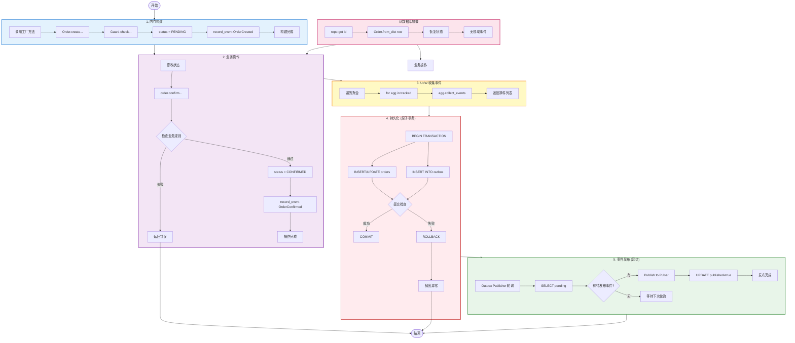

# 聚合生命周期

展示聚合从创建、修改到持久化的完整生命周期。

```mermaid
flowchart TD
    Start([开始]) --> Creation[1. 内存构建]
    
    subgraph Creation["1. 内存构建"]
        C1[调用工厂方法] --> C2[Order.create...]
        C2 --> C3[Guard.check...]
        C3 --> C4[status = PENDING]
        C4 --> C5[record_event OrderCreated]
        C5 --> C6[构建完成]
    end
    
    Creation --> Operation[2. 业务操作]
    
    subgraph Operation["2. 业务操作"]
        O1[修改状态] --> O2[order.confirm...]
        O2 --> O3{检查业务规则}
        O3 -->|通过| O4[status = CONFIRMED]
        O3 -->|失败| O99[返回错误]
        O4 --> O5[record_event OrderConfirmed]
        O5 --> O6[操作完成]
    end
    
    Operation --> UoW[3. UoW 收集事件]
    
    subgraph UoW["3. UoW 收集事件"]
        U1[遍历聚合] --> U2[for agg in tracked]
        U2 --> U3[agg.collect_events]
        U3 --> U4[返回事件列表]
    end
    
    UoW --> Persistence[4. 持久化]
    
    subgraph Persistence["4. 持久化 (原子事务)"]
        P1[BEGIN TRANSACTION] --> P2[INSERT/UPDATE orders]
        P1 --> P3[INSERT INTO outbox]
        P2 --> P4{提交检查}
        P3 --> P4
        P4 -->|成功| P5[COMMIT]
        P4 -->|失败| P6[ROLLBACK]
        P6 --> P99[抛出异常]
    end
    
    Persistence --> Async[5. 异步发布]
    
    subgraph Async["5. 事件发布 (异步)"]
        A1[Outbox Publisher 轮询] --> A2[SELECT pending]
        A2 --> A3{有待发布事件?}
        A3 -->|有| A4[Publish to Pulsar]
        A3 -->|无| A5[等待下次轮询]
        A4 --> A6[UPDATE published=true]
        A6 --> A7[发布完成]
    end
    
    Async --> End([结束])
    
    LoadDB[从数据库加载] --> LoadOp[业务操作]
    
    subgraph LoadDB["从数据库加载"]
        L1[repo.get id] --> L2[Order.from_dict row]
        L2 --> L3[恢复状态]
        L3 --> L4[无领域事件]
    end
    
    LoadDB --> Operation
    
    O99 --> End
    P99 --> End
    
    style Creation fill:#e3f2fd,stroke:#1976d2,stroke-width:2px
    style Operation fill:#f3e5f5,stroke:#7b1fa2,stroke-width:2px
    style UoW fill:#fff9c4,stroke:#f57f17,stroke-width:2px
    style Persistence fill:#ffebee,stroke:#c62828,stroke-width:2px
    style Async fill:#e8f5e9,stroke:#388e3c,stroke-width:2px
    style LoadDB fill:#fce4ec,stroke:#c2185b,stroke-width:2px
```
