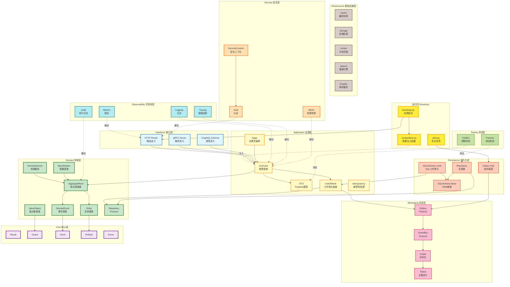

# 组件关系图

详细展示各层核心组件及其交互关系。

```mermaid
graph TB
    subgraph "运行时 (Runtime)"
        BOOTSTRAP[bootstrap.py<br/>应用启动]
        COMPOSE[composition.py<br/>依赖注入容器]
        JOBS[jobs.py<br/>后台任务]
    end

    subgraph "Interfaces 接口层"
        HTTP_ROUTER[HTTP Router<br/>路由定义]
        GRPC_SERVER[gRPC Server<br/>服务定义]
        GQL_SCHEMA[GraphQL Schema<br/>类型定义]
    end

    subgraph "Application 应用层"
        USECASE[UseCase<br/>用例基类]
        DTO_BASE[DTO<br/>Pydantic模型]
        UOW_BASE[UnitOfWork<br/>工作单元抽象]
        SAGA_BASE[Saga<br/>长事务编排]
        IDEMPOTENCY[Idempotency<br/>幂等性处理]
    end

    subgraph "Domain 领域层"
        ENTITY_BASE[Entity<br/>实体基类]
        AGG_BASE[AggregateRoot<br/>聚合根基类]
        VO_BASE[ValueObject<br/>值对象基类]
        EVENT_BASE[DomainEvent<br/>事件基类]
        REPO_PROTO[Repository<br/>Protocol]
        SPEC_BASE[Specification<br/>规格基类]
        SVC_BASE[DomainService<br/>领域服务]
    end

    subgraph "Persistence 持久化层"
        REPO_IMPL[Repository<br/>实现类]
        SQL_UOW[SQLAlchemy UoW<br/>SQL工作单元]
        SQL_BASE[SQLAlchemy Base<br/>ORM基类]
        OUTBOX_SQL[Outbox SQL<br/>发件箱表]
    end

    subgraph "Messaging 消息层"
        BUS_PROTO[EventBus<br/>Protocol]
        OUTBOX_PROTO[Outbox<br/>Protocol]
        CODEC[Codec<br/>序列化]
        TOPICS[Topics<br/>主题定义]
    end

    subgraph Infrastructure["Infrastructure 基础设施层"]
        CACHE_IMPL[Cache<br/>缓存实现]
        STORAGE_IMPL[Storage<br/>存储实现]
        LOCKER_IMPL[Locker<br/>分布式锁]
        SEARCH_IMPL[Search<br/>搜索引擎]
        EMAIL_IMPL[Emailer<br/>邮件服务]
    end

    subgraph Observability["Observability 可观测层"]
        LOGGING[Logging<br/>日志]
        METRICS[Metrics<br/>指标]
        TRACING[Tracing<br/>链路追踪]
        AUDIT[Audit<br/>审计日志]
    end

    subgraph Security["Security 安全层"]
        AUTH[Auth<br/>认证]
        RBAC[RBAC<br/>权限控制]
        CONTEXT[SecurityContext<br/>安全上下文]
    end

    subgraph Testing["Testing 测试层"]
        FIXTURES[Fixtures<br/>测试夹具]
        GOLDEN[Golden<br/>快照测试]
    end

    subgraph Core["Core 核心层"]
        RESULT["Result<T,E>"]
        GUARD[Guard]
        CLOCK[Clock]
        ENTITY_ID[EntityId]
        ERRORS[Errors]
    end

    %% 运行时连接
    BOOTSTRAP --> COMPOSE
    BOOTSTRAP --> HTTP_ROUTER
    COMPOSE -.注入.-> USECASE
    JOBS --> OUTBOX_SQL

    %% 接口层连接
    HTTP_ROUTER --> USECASE
    GRPC_SERVER --> USECASE
    GQL_SCHEMA --> USECASE

    %% 应用层连接
    USECASE --> UOW_BASE
    USECASE --> DTO_BASE
    USECASE --> AGG_BASE
    SAGA_BASE --> USECASE
    
    %% UoW 连接
    UOW_BASE --> REPO_PROTO
    UOW_BASE --> OUTBOX_PROTO
    SQL_UOW --> UOW_BASE
    SQL_UOW --> SQL_BASE

    %% 领域层连接
    AGG_BASE --> ENTITY_BASE
    AGG_BASE --> EVENT_BASE
    ENTITY_BASE --> ENTITY_ID
    VO_BASE --> GUARD
    EVENT_BASE --> CLOCK
    SVC_BASE --> AGG_BASE
    SPEC_BASE --> AGG_BASE

    %% 持久化连接
    REPO_IMPL --> REPO_PROTO
    REPO_IMPL --> SQL_BASE
    OUTBOX_SQL --> OUTBOX_PROTO

    %% 消息层连接
    OUTBOX_PROTO --> BUS_PROTO
    BUS_PROTO --> CODEC
    CODEC --> TOPICS

    %% 可观测层连接
    LOGGING -.横切.-> USECASE
    METRICS -.横切.-> HTTP_ROUTER
    TRACING -.横切.-> USECASE
    AUDIT -.横切.-> AGG_BASE

    %% 安全层连接
    AUTH -.横切.-> HTTP_ROUTER
    RBAC -.横切.-> USECASE
    CONTEXT --> AUTH

    %% 测试层连接
    FIXTURES -.测试.-> REPO_IMPL
    GOLDEN -.测试.-> DTO_BASE

    %% 样式
    classDef runtime fill:#ffeb3b,stroke:#f57c00,stroke-width:2px
    classDef interface fill:#e1f5ff,stroke:#01579b,stroke-width:2px
    classDef application fill:#fff9c4,stroke:#f57f17,stroke-width:2px
    classDef domain fill:#c8e6c9,stroke:#2e7d32,stroke-width:3px
    classDef persistence fill:#ffccbc,stroke:#d84315,stroke-width:2px
    classDef messaging fill:#f8bbd0,stroke:#c2185b,stroke-width:2px
    classDef infrastructure fill:#d7ccc8,stroke:#5d4037,stroke-width:2px
    classDef observability fill:#b2ebf2,stroke:#006064,stroke-width:2px
    classDef security fill:#ffe0b2,stroke:#e65100,stroke-width:2px
    classDef testing fill:#c5e1a5,stroke:#558b2f,stroke-width:2px
    classDef core fill:#f3e5f5,stroke:#6a1b9a,stroke-width:3px

    class BOOTSTRAP,COMPOSE,JOBS runtime
    class HTTP_ROUTER,GRPC_SERVER,GQL_SCHEMA interface
    class USECASE,DTO_BASE,UOW_BASE,SAGA_BASE,IDEMPOTENCY application
    class ENTITY_BASE,AGG_BASE,VO_BASE,EVENT_BASE,REPO_PROTO,SPEC_BASE,SVC_BASE domain
    class REPO_IMPL,SQL_UOW,SQL_BASE,OUTBOX_SQL persistence
    class BUS_PROTO,OUTBOX_PROTO,CODEC,TOPICS messaging
    class CACHE_IMPL,STORAGE_IMPL,LOCKER_IMPL,SEARCH_IMPL,EMAIL_IMPL infrastructure
    class LOGGING,METRICS,TRACING,AUDIT observability
    class AUTH,RBAC,CONTEXT security
    class FIXTURES,GOLDEN testing
    class RESULT,GUARD,CLOCK,ENTITY_ID,ERRORS core
```

