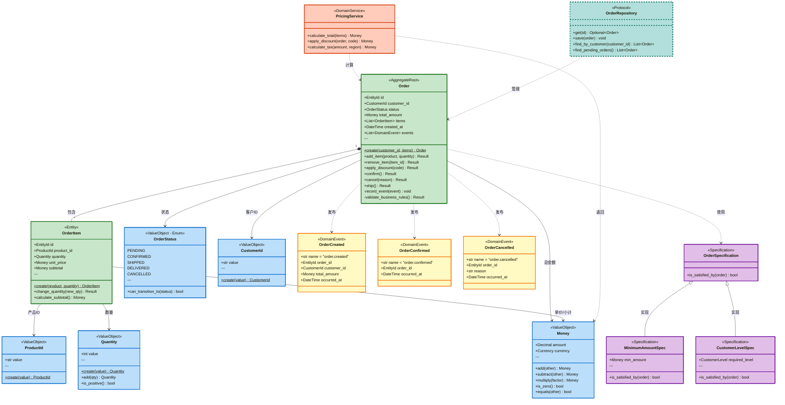

# 领域模型示例

以订单域为例，展示聚合、实体、值对象的建模方式。

```mermaid
classDiagram
    %% 聚合根
    class Order {
        <<AggregateRoot>>
        +EntityId id
        +CustomerId customer_id
        +OrderStatus status
        +Money total_amount
        +List~OrderItem~ items
        +DateTime created_at
        +List~DomainEvent~ events
        ---
        +create(customer_id, items)$ Order
        +add_item(product, quantity) Result
        +remove_item(item_id) Result
        +apply_discount(code) Result
        +confirm() Result
        +cancel(reason) Result
        +ship() Result
        -record_event(event) void
        -validate_business_rules() Result
    }

    %% 实体
    class OrderItem {
        <<Entity>>
        +EntityId id
        +ProductId product_id
        +Quantity quantity
        +Money unit_price
        +Money subtotal
        ---
        +create(product, quantity)$ OrderItem
        +change_quantity(new_qty) Result
        +calculate_subtotal() Money
    }

    %% 值对象
    class Money {
        <<ValueObject>>
        +Decimal amount
        +Currency currency
        ---
        +add(other) Money
        +subtract(other) Money
        +multiply(factor) Money
        +is_zero() bool
        +equals(other) bool
    }

    class Quantity {
        <<ValueObject>>
        +int value
        ---
        +create(value)$ Quantity
        +add(qty) Quantity
        +is_positive() bool
    }

    class OrderStatus {
        <<ValueObject - Enum>>
        PENDING
        CONFIRMED
        SHIPPED
        DELIVERED
        CANCELLED
        ---
        +can_transition_to(status) bool
    }

    class CustomerId {
        <<ValueObject>>
        +str value
        ---
        +create(value)$ CustomerId
    }

    class ProductId {
        <<ValueObject>>
        +str value
        ---
        +create(value)$ ProductId
    }

    %% 领域事件
    class OrderCreated {
        <<DomainEvent>>
        +str name = "order.created"
        +EntityId order_id
        +CustomerId customer_id
        +Money total_amount
        +DateTime occurred_at
    }

    class OrderConfirmed {
        <<DomainEvent>>
        +str name = "order.confirmed"
        +EntityId order_id
        +DateTime occurred_at
    }

    class OrderCancelled {
        <<DomainEvent>>
        +str name = "order.cancelled"
        +EntityId order_id
        +str reason
        +DateTime occurred_at
    }

    %% 规格模式
    class OrderSpecification {
        <<Specification>>
        +is_satisfied_by(order) bool
    }

    class MinimumAmountSpec {
        <<Specification>>
        +Money min_amount
        ---
        +is_satisfied_by(order) bool
    }

    class CustomerLevelSpec {
        <<Specification>>
        +CustomerLevel required_level
        ---
        +is_satisfied_by(order) bool
    }

    %% 领域服务
    class PricingService {
        <<DomainService>>
        +calculate_total(items) Money
        +apply_discount(order, code) Money
        +calculate_tax(amount, region) Money
    }

    %% 仓储接口
    class OrderRepository {
        <<Protocol>>
        +get(id) Optional~Order~
        +save(order) void
        +find_by_customer(customer_id) List~Order~
        +find_pending_orders() List~Order~
    }

    %% 关系
    Order "1" *-- "*" OrderItem : 包含
    Order --> OrderStatus : 状态
    Order --> Money : 总金额
    Order --> CustomerId : 客户ID
    
    OrderItem --> ProductId : 产品ID
    OrderItem --> Quantity : 数量
    OrderItem --> Money : 单价/小计
    
    Order ..> OrderCreated : 发布
    Order ..> OrderConfirmed : 发布
    Order ..> OrderCancelled : 发布
    
    OrderSpecification <|-- MinimumAmountSpec : 实现
    OrderSpecification <|-- CustomerLevelSpec : 实现
    Order ..> OrderSpecification : 使用
    
    PricingService ..> Order : 计算
    PricingService ..> Money : 返回
    
    OrderRepository ..> Order : 管理

    %% 样式
    style Order fill:#c8e6c9,stroke:#2e7d32,stroke-width:3px
    style OrderItem fill:#c8e6c9,stroke:#2e7d32,stroke-width:2px
    style Money fill:#bbdefb,stroke:#1976d2,stroke-width:2px
    style Quantity fill:#bbdefb,stroke:#1976d2,stroke-width:2px
    style OrderStatus fill:#bbdefb,stroke:#1976d2,stroke-width:2px
    style CustomerId fill:#bbdefb,stroke:#1976d2,stroke-width:2px
    style ProductId fill:#bbdefb,stroke:#1976d2,stroke-width:2px
    style OrderCreated fill:#fff9c4,stroke:#f57f17,stroke-width:2px
    style OrderConfirmed fill:#fff9c4,stroke:#f57f17,stroke-width:2px
    style OrderCancelled fill:#fff9c4,stroke:#f57f17,stroke-width:2px
    style OrderSpecification fill:#e1bee7,stroke:#7b1fa2,stroke-width:2px
    style MinimumAmountSpec fill:#e1bee7,stroke:#7b1fa2,stroke-width:2px
    style CustomerLevelSpec fill:#e1bee7,stroke:#7b1fa2,stroke-width:2px
    style PricingService fill:#ffccbc,stroke:#d84315,stroke-width:2px
    style OrderRepository fill:#b2dfdb,stroke:#00695c,stroke-width:2px,stroke-dasharray:5 5
```

