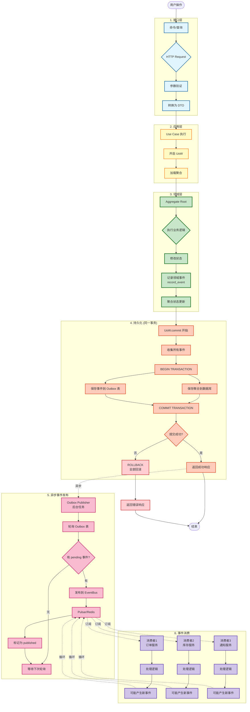

# 事件驱动处理流程

从命令触发到事件发布的完整链路。

```mermaid
graph TB
    START([用户操作]) --> CMD[命令/查询]
    
    subgraph Interface["1. 接口层"]
        CMD --> HTTP{HTTP Request}
        HTTP --> VALIDATE[参数验证]
        VALIDATE --> DTO[转换为 DTO]
    end
    
    subgraph Application["2. 应用层"]
        DTO --> UC[Use Case 执行]
        UC --> BEGIN_UOW[开启 UoW]
        BEGIN_UOW --> LOAD[加载聚合]
    end
    
    subgraph Domain["3. 领域层"]
        LOAD --> AGG[Aggregate Root]
        AGG --> BIZ_LOGIC{执行业务逻辑}
        BIZ_LOGIC --> CHANGE[修改状态]
        CHANGE --> RECORD_EVT[记录领域事件<br/>record_event]
        RECORD_EVT --> AGG_UPDATED[聚合状态更新]
    end
    
    subgraph Persistence["4. 持久化 (同一事务)"]
        AGG_UPDATED --> COMMIT_START[UoW.commit 开始]
        COMMIT_START --> COLLECT[收集所有事件]
        COLLECT --> BEGIN_TX[BEGIN TRANSACTION]
        
        BEGIN_TX --> SAVE_AGG[保存聚合到数据库]
        BEGIN_TX --> SAVE_OUTBOX[保存事件到 Outbox 表]
        
        SAVE_AGG --> COMMIT_TX[COMMIT TRANSACTION]
        SAVE_OUTBOX --> COMMIT_TX
        
        COMMIT_TX --> SUCCESS{提交成功?}
        SUCCESS -->|是| RESPOND[返回成功响应]
        SUCCESS -->|否| ROLLBACK[ROLLBACK<br/>全部回滚]
    end
    
    subgraph AsyncPublish["5. 异步事件发布"]
        RESPOND -.异步.-> PUBLISHER[Outbox Publisher<br/>后台任务]
        PUBLISHER --> POLL[轮询 Outbox 表]
        POLL --> PENDING{有 pending 事件?}
        PENDING -->|有| PUBLISH[发布到 EventBus]
        PENDING -->|无| WAIT[等待下次轮询]
        PUBLISH --> PULSAR[Pulsar/Redis]
        PULSAR --> MARK[标记为 published]
        MARK --> WAIT
    end
    
    subgraph Consumer["6. 事件消费"]
        PULSAR -.订阅.-> CONSUMER1[消费者1<br/>订单服务]
        PULSAR -.订阅.-> CONSUMER2[消费者2<br/>库存服务]
        PULSAR -.订阅.-> CONSUMER3[消费者3<br/>通知服务]
        
        CONSUMER1 --> HANDLER1[处理逻辑]
        CONSUMER2 --> HANDLER2[处理逻辑]
        CONSUMER3 --> HANDLER3[处理逻辑]
        
        HANDLER1 --> NEW_EVT1[可能产生新事件]
        HANDLER2 --> NEW_EVT2[可能产生新事件]
        HANDLER3 --> NEW_EVT3[可能产生新事件]
    end
    
    RESPOND --> END([结束])
    ROLLBACK --> ERROR_RESP[返回错误响应]
    ERROR_RESP --> END
    
    NEW_EVT1 -.循环.-> PULSAR
    NEW_EVT2 -.循环.-> PULSAR
    NEW_EVT3 -.循环.-> PULSAR

    %% 样式
    classDef interface fill:#e1f5ff,stroke:#01579b,stroke-width:2px
    classDef application fill:#fff9c4,stroke:#f57f17,stroke-width:2px
    classDef domain fill:#c8e6c9,stroke:#2e7d32,stroke-width:3px
    classDef persistence fill:#ffccbc,stroke:#d84315,stroke-width:2px
    classDef async fill:#f8bbd0,stroke:#c2185b,stroke-width:2px
    classDef consumer fill:#d1c4e9,stroke:#512da8,stroke-width:2px
    classDef error fill:#ffcdd2,stroke:#c62828,stroke-width:2px

    class CMD,HTTP,VALIDATE,DTO interface
    class UC,BEGIN_UOW,LOAD application
    class AGG,BIZ_LOGIC,CHANGE,RECORD_EVT,AGG_UPDATED domain
    class COMMIT_START,COLLECT,BEGIN_TX,SAVE_AGG,SAVE_OUTBOX,COMMIT_TX,SUCCESS,RESPOND persistence
    class PUBLISHER,POLL,PENDING,PUBLISH,PULSAR,MARK,WAIT async
    class CONSUMER1,CONSUMER2,CONSUMER3,HANDLER1,HANDLER2,HANDLER3,NEW_EVT1,NEW_EVT2,NEW_EVT3 consumer
    class ROLLBACK,ERROR_RESP error
```

