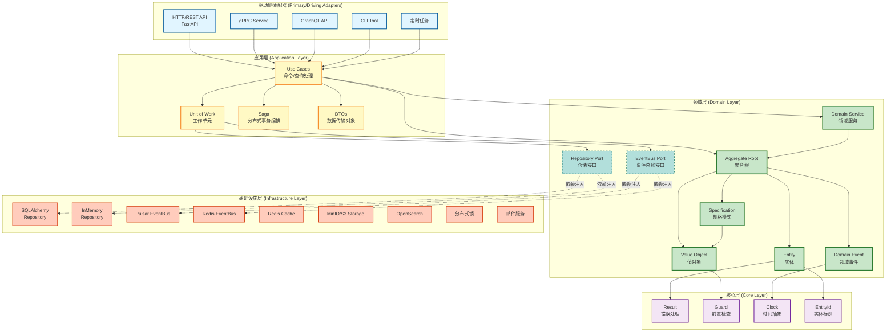

# 六边形架构总览

展示 Bento Framework 的六边形（端口与适配器）架构全貌，包括驱动侧和被驱动侧适配器。

```mermaid
graph TB
    subgraph Driving["驱动侧适配器 (Primary/Driving Adapters)"]
        HTTP[HTTP/REST API<br/>FastAPI]
        GRPC[gRPC Service]
        GraphQL[GraphQL API]
        CLI[CLI Tool]
        Scheduler[定时任务]
    end

    subgraph Application["应用层 (Application Layer)"]
        UC[Use Cases<br/>命令/查询处理]
        UOW[Unit of Work<br/>工作单元]
        SAGA[Saga<br/>分布式事务编排]
        DTO[DTOs<br/>数据传输对象]
    end

    subgraph Domain["领域层 (Domain Layer)"]
        AGG[Aggregate Root<br/>聚合根]
        ENT[Entity<br/>实体]
        VO[Value Object<br/>值对象]
        EVT[Domain Event<br/>领域事件]
        SPEC[Specification<br/>规格模式]
        DSVC[Domain Service<br/>领域服务]
        REPO_PORT[Repository Port<br/>仓储接口]
        BUS_PORT[EventBus Port<br/>事件总线接口]
    end

    subgraph Infrastructure["基础设施层 (Infrastructure Layer)"]
        SQL[SQLAlchemy<br/>Repository]
        INMEM[InMemory<br/>Repository]
        PULSAR[Pulsar EventBus]
        REDIS_BUS[Redis EventBus]
        CACHE[Redis Cache]
        STORAGE[MinIO/S3 Storage]
        SEARCH[OpenSearch]
        LOCKER[分布式锁]
        EMAIL[邮件服务]
    end

    subgraph Core["核心层 (Core Layer)"]
        RESULT["Result<T,E><br/>错误处理"]
        GUARD[Guard<br/>前置检查]
        CLOCK[Clock<br/>时间抽象]
        IDS[EntityId<br/>实体标识]
    end

    %% 驱动侧依赖
    HTTP --> UC
    GRPC --> UC
    GraphQL --> UC
    CLI --> UC
    Scheduler --> UC

    %% 应用层依赖
    UC --> UOW
    UC --> DTO
    UC --> SAGA
    UC --> AGG
    UC --> DSVC
    
    UOW --> REPO_PORT
    UOW --> BUS_PORT

    %% 领域层依赖
    AGG --> ENT
    AGG --> VO
    AGG --> EVT
    AGG --> SPEC
    
    DSVC --> AGG
    SPEC --> VO
    
    REPO_PORT -.依赖注入.-> SQL
    REPO_PORT -.依赖注入.-> INMEM
    BUS_PORT -.依赖注入.-> PULSAR
    BUS_PORT -.依赖注入.-> REDIS_BUS

    %% 核心层依赖
    ENT --> IDS
    ENT --> RESULT
    VO --> GUARD
    EVT --> CLOCK

    %% 样式定义
    classDef driving fill:#e1f5ff,stroke:#01579b,stroke-width:2px
    classDef application fill:#fff9c4,stroke:#f57f17,stroke-width:2px
    classDef domain fill:#c8e6c9,stroke:#2e7d32,stroke-width:3px
    classDef infrastructure fill:#ffccbc,stroke:#d84315,stroke-width:2px
    classDef core fill:#f3e5f5,stroke:#6a1b9a,stroke-width:2px
    classDef port fill:#b2dfdb,stroke:#00695c,stroke-width:2px,stroke-dasharray: 5 5

    class HTTP,GRPC,GraphQL,CLI,Scheduler driving
    class UC,UOW,SAGA,DTO application
    class AGG,ENT,VO,EVT,SPEC,DSVC domain
    class SQL,INMEM,PULSAR,REDIS_BUS,CACHE,STORAGE,SEARCH,LOCKER,EMAIL infrastructure
    class RESULT,GUARD,CLOCK,IDS core
    class REPO_PORT,BUS_PORT port
```

