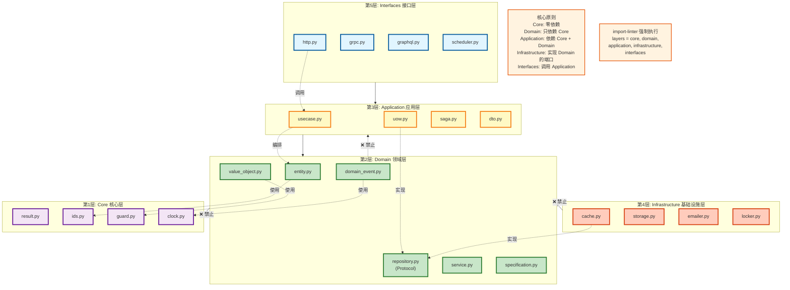

# DDD 分层依赖关系

展示 Core → Domain → Application → Infrastructure → Interfaces 的依赖方向和规则。

```mermaid
graph TB
    subgraph L5["第5层: Interfaces 接口层"]
        I_HTTP["http.py"]
        I_GRPC["grpc.py"]
        I_GQL["graphql.py"]
        I_SCHED["scheduler.py"]
    end
    
    subgraph L4["第4层: Infrastructure 基础设施层"]
        INF_CACHE["cache.py"]
        INF_STORAGE["storage.py"]
        INF_EMAIL["emailer.py"]
        INF_LOCK["locker.py"]
    end
    
    subgraph L3["第3层: Application 应用层"]
        APP_UC["usecase.py"]
        APP_UOW["uow.py"]
        APP_SAGA["saga.py"]
        APP_DTO["dto.py"]
    end
    
    subgraph L2["第2层: Domain 领域层"]
        DOM_ENT["entity.py"]
        DOM_VO["value_object.py"]
        DOM_EVT["domain_event.py"]
        DOM_REPO["repository.py<br/>(Protocol)"]
        DOM_SVC["service.py"]
        DOM_SPEC["specification.py"]
    end
    
    subgraph L1["第1层: Core 核心层"]
        CORE_RES["result.py"]
        CORE_ID["ids.py"]
        CORE_GUARD["guard.py"]
        CORE_CLOCK["clock.py"]
    end

    %% 依赖关系
    L5 --> L3
    L4 --> L2
    L3 --> L2
    L2 --> L1

    %% 详细说明
    I_HTTP -.调用.-> APP_UC
    APP_UC -.编排.-> DOM_ENT
    APP_UOW -.实现.-> DOM_REPO
    DOM_ENT -.使用.-> CORE_ID
    DOM_VO -.使用.-> CORE_GUARD
    DOM_EVT -.使用.-> CORE_CLOCK
    INF_CACHE -.实现.-> DOM_REPO

    %% 禁止的依赖 (红色虚线)
    L2 -.❌ 禁止.-> L3
    L2 -.❌ 禁止.-> L4
    L1 -.❌ 禁止.-> L2
    
    %% 注释
    NOTE1["核心原则<br/>Core: 零依赖<br/>Domain: 只依赖 Core<br/>Application: 依赖 Core + Domain<br/>Infrastructure: 实现 Domain 的端口<br/>Interfaces: 调用 Application"]

    NOTE2["import-linter 强制执行<br/>layers = core, domain,<br/>application, infrastructure,<br/>interfaces"]

    %% 样式
    classDef layer1 fill:#f3e5f5,stroke:#6a1b9a,stroke-width:3px
    classDef layer2 fill:#c8e6c9,stroke:#2e7d32,stroke-width:3px
    classDef layer3 fill:#fff9c4,stroke:#f57f17,stroke-width:3px
    classDef layer4 fill:#ffccbc,stroke:#d84315,stroke-width:3px
    classDef layer5 fill:#e1f5ff,stroke:#01579b,stroke-width:3px
    classDef note fill:#fff3e0,stroke:#e65100,stroke-width:2px

    class CORE_RES,CORE_ID,CORE_GUARD,CORE_CLOCK layer1
    class DOM_ENT,DOM_VO,DOM_EVT,DOM_REPO,DOM_SVC,DOM_SPEC layer2
    class APP_UC,APP_UOW,APP_SAGA,APP_DTO layer3
    class INF_CACHE,INF_STORAGE,INF_EMAIL,INF_LOCK layer4
    class I_HTTP,I_GRPC,I_GQL,I_SCHED layer5
    class NOTE1,NOTE2 note
```

