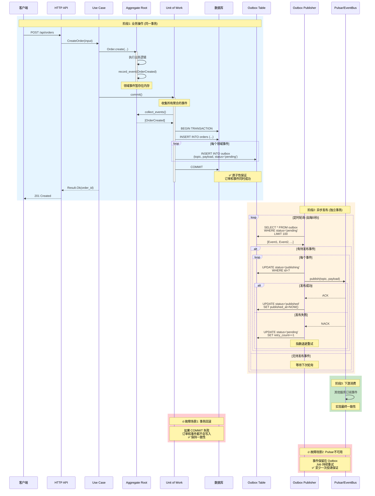

# Outbox 模式工作流程

展示事务性消息发送的完整流程，保证数据一致性。

```mermaid
sequenceDiagram
    participant Client as 客户端
    participant API as HTTP API
    participant UseCase as Use Case
    participant Aggregate as Aggregate Root
    participant UoW as Unit of Work
    participant DB as 数据库
    participant Outbox as Outbox Table
    participant Job as Outbox Publisher
    participant Pulsar as Pulsar/EventBus

    rect rgb(230, 245, 255)
        Note over Client,Outbox: 阶段1: 业务操作 (同一事务)
        
        Client->>API: POST /api/orders
        API->>UseCase: CreateOrder(input)
        UseCase->>Aggregate: Order.create(...)
        
        activate Aggregate
        Aggregate->>Aggregate: 执行业务逻辑
        Aggregate->>Aggregate: record_event(OrderCreated)
        Note over Aggregate: 领域事件暂存在内存
        deactivate Aggregate
        
        UseCase->>UoW: commit()
        
        activate UoW
        Note over UoW: 收集所有聚合的事件
        UoW->>Aggregate: collect_events()
        Aggregate-->>UoW: [OrderCreated]
        
        UoW->>DB: BEGIN TRANSACTION
        UoW->>DB: INSERT INTO orders (...)
        
        loop 每个领域事件
            UoW->>Outbox: INSERT INTO outbox<br/>(topic, payload, status='pending')
        end
        
        UoW->>DB: COMMIT
        Note over DB,Outbox: ✅ 原子性保证<br/>订单和事件同时成功
        deactivate UoW
        
        UseCase-->>API: Result.Ok(order_id)
        API-->>Client: 201 Created
    end

    rect rgb(255, 243, 224)
        Note over Job,Pulsar: 阶段2: 异步发布 (独立事务)
        
        loop 定时轮询 (如每5秒)
            Job->>Outbox: SELECT * FROM outbox<br/>WHERE status='pending'<br/>LIMIT 100
            Outbox-->>Job: [Event1, Event2, ...]
            
            alt 有待发布事件
                loop 每个事件
                    Job->>Outbox: UPDATE status='publishing'<br/>WHERE id=?
                    Job->>Pulsar: publish(topic, payload)
                    
                    alt 发布成功
                        Pulsar-->>Job: ACK
                        Job->>Outbox: UPDATE status='published'<br/>SET published_at=NOW()
                    else 发布失败
                        Pulsar-->>Job: NACK
                        Job->>Outbox: UPDATE status='pending'<br/>SET retry_count+=1
                        Note over Job: 指数退避重试
                    end
                end
            else 无待发布事件
                Note over Job: 等待下次轮询
            end
        end
    end

    rect rgb(200, 230, 201)
        Note over Pulsar: 阶段3: 下游消费
        
        Pulsar->>Pulsar: 其他服务订阅事件
        Note over Pulsar: 实现最终一致性
    end

    %% 故障场景说明
    rect rgb(255, 205, 210)
        Note over UoW,DB: 🔥 故障场景1: 事务回滚
        Note over UoW,DB: 如果 COMMIT 失败<br/>订单和事件都不会写入<br/>✅ 保持一致性
    end

    rect rgb(255, 205, 210)
        Note over Job,Pulsar: 🔥 故障场景2: Pulsar不可用
        Note over Job,Pulsar: 事件保留在 Outbox<br/>Job 持续重试<br/>✅ 至少一次投递保证
    end
```

