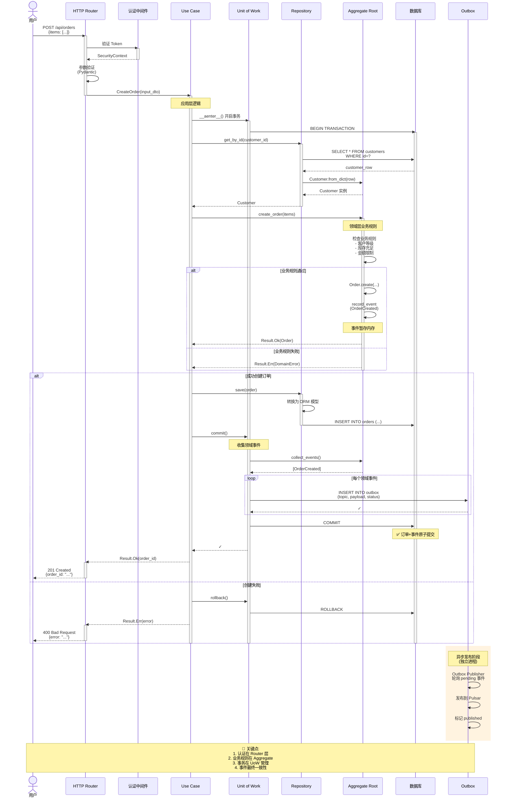

# 用例执行序列图

展示 HTTP 请求 → UseCase → Domain → Repository 的完整调用序列。

```mermaid
sequenceDiagram
    actor User as 用户
    participant Router as HTTP Router
    participant Auth as 认证中间件
    participant UseCase as Use Case
    participant UoW as Unit of Work
    participant Repo as Repository
    participant Aggregate as Aggregate Root
    participant DB as 数据库
    participant Outbox as Outbox

    %% 1. 请求阶段
    User->>Router: POST /api/orders<br/>{items: [...]}
    activate Router
    
    Router->>Auth: 验证 Token
    activate Auth
    Auth-->>Router: SecurityContext
    deactivate Auth
    
    Router->>Router: 参数验证<br/>(Pydantic)
    Router->>UseCase: CreateOrder(input_dto)
    deactivate Router
    
    %% 2. 用例执行
    activate UseCase
    Note over UseCase: 应用层逻辑
    
    UseCase->>UoW: __aenter__() 开启事务
    activate UoW
    UoW->>DB: BEGIN TRANSACTION
    activate DB
    
    %% 3. 加载聚合
    UseCase->>Repo: get_by_id(customer_id)
    activate Repo
    Repo->>DB: SELECT * FROM customers<br/>WHERE id=?
    DB-->>Repo: customer_row
    Repo->>Aggregate: Customer.from_dict(row)
    Aggregate-->>Repo: Customer 实例
    Repo-->>UseCase: Customer
    deactivate Repo
    
    %% 4. 领域逻辑
    UseCase->>Aggregate: create_order(items)
    activate Aggregate
    Note over Aggregate: 领域层业务规则
    
    Aggregate->>Aggregate: 检查业务规则<br/>- 客户等级<br/>- 库存充足<br/>- 金额限制
    
    alt 业务规则通过
        Aggregate->>Aggregate: Order.create(...)
        Aggregate->>Aggregate: record_event<br/>(OrderCreated)
        Note over Aggregate: 事件暂存内存
        Aggregate-->>UseCase: Result.Ok(Order)
    else 业务规则失败
        Aggregate-->>UseCase: Result.Err(DomainError)
    end
    deactivate Aggregate
    
    %% 5. 保存聚合
    alt 成功创建订单
        UseCase->>Repo: save(order)
        activate Repo
        Repo->>Repo: 转换为 ORM 模型
        Repo->>DB: INSERT INTO orders (...)
        deactivate Repo
        
        %% 6. 提交事务
        UseCase->>UoW: commit()
        
        Note over UoW: 收集领域事件
        UoW->>Aggregate: collect_events()
        Aggregate-->>UoW: [OrderCreated]
        
        loop 每个领域事件
            UoW->>Outbox: INSERT INTO outbox<br/>(topic, payload, status)
            Outbox-->>UoW: ✓
        end
        
        UoW->>DB: COMMIT
        Note over DB: ✅ 订单+事件原子提交
        
        UoW-->>UseCase: ✓
        
        UseCase-->>Router: Result.Ok(order_id)
        activate Router
        Router-->>User: 201 Created<br/>{order_id: "..."}
        deactivate Router
        
    else 创建失败
        UseCase->>UoW: rollback()
        UoW->>DB: ROLLBACK
        
        UseCase-->>Router: Result.Err(error)
        activate Router
        Router-->>User: 400 Bad Request<br/>{error: "..."}
        deactivate Router
    end
    
    deactivate DB
    deactivate UoW
    deactivate UseCase

    %% 7. 后台发布事件 (异步)
    rect rgb(255, 243, 224)
        Note over Outbox: 异步发布阶段<br/>(独立进程)
        
        Outbox->>Outbox: Outbox Publisher<br/>轮询 pending 事件
        Outbox->>Outbox: 发布到 Pulsar
        Outbox->>Outbox: 标记 published
    end

    %% 注释说明
    Note over User,Outbox: 🎯 关键点:<br/>1. 认证在 Router 层<br/>2. 业务规则在 Aggregate<br/>3. 事务在 UoW 管理<br/>4. 事件最终一致性
```

