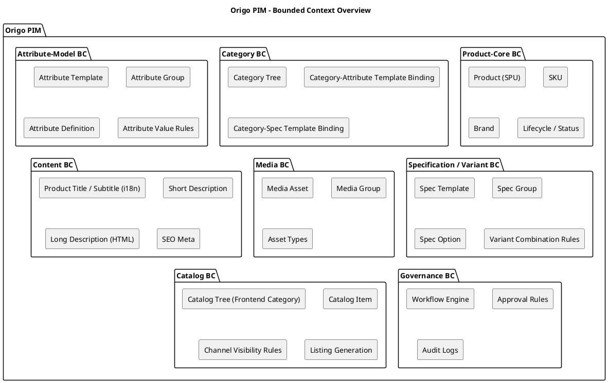

```plantuml
@startuml
title Origo PIM - Bounded Context Overview

package "Origo PIM" {

  package "Product-Core BC" as PRODUCT_CORE {
    rectangle "Product (SPU)" as SPU
    rectangle "SKU" as SKU
    rectangle "Brand"
    rectangle "Lifecycle / Status"
  }

  package "Category BC" as CATEGORY {
    rectangle "Category Tree"
    rectangle "Category-Attribute Template Binding"
    rectangle "Category-Spec Template Binding"
  }

  package "Attribute-Model BC" as ATTRIBUTE {
    rectangle "Attribute Template"
    rectangle "Attribute Group"
    rectangle "Attribute Definition"
    rectangle "Attribute Value Rules"
  }

  package "Specification / Variant BC" as SPEC {
    rectangle "Spec Template"
    rectangle "Spec Group"
    rectangle "Spec Option"
    rectangle "Variant Combination Rules"
  }

  package "Media BC" as MEDIA {
    rectangle "Media Asset"
    rectangle "Media Group"
    rectangle "Asset Types"
  }

  package "Content BC" as CONTENT {
    rectangle "Product Title / Subtitle (i18n)"
    rectangle "Short Description"
    rectangle "Long Description (HTML)"
    rectangle "SEO Meta"
  }

  package "Governance BC" as GOVERN {
    rectangle "Workflow Engine"
    rectangle "Approval Rules"
    rectangle "Audit Logs"
  }

  package "Catalog BC" as CATALOG {
    rectangle "Catalog Tree (Frontend Category)"
    rectangle "Catalog Item"
    rectangle "Channel Visibility Rules"
    rectangle "Listing Generation"
  }
}
@enduml
```
