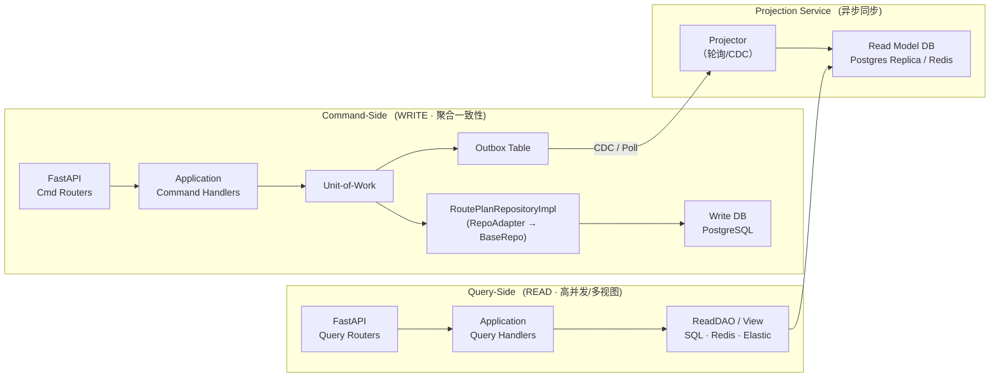

### 在现有「胖 BaseRepo + 瘦 Adapter + UoW + Outbox + 多租户」框架之上落地 **CQRS（Command Query Responsibility Segregation）**

---

## 1 总览：读写完全分离 


* **写路径**：保持聚合模型 + UoW + Outbox → 强一致  
* **读路径**：无聚合、无事务锁；直接查询投影表/缓存 → 高性能  
* **同步桥梁**：项目已有 **Outbox 表**，只需新增 **Projector** 来消费并更新 Read-DB

---

## 2 新目录（在现有项目基础上追加）

```
idp/
├─ application/
│  ├─ command/            # 已有：handler / dto
│  └─ query/
│     ├─ dto.py
│     ├─ handlers.py      # 新增
│     └─ dao/             # 纯 SQL / Redis
│         └─ route_plan_dao.py
├─ infrastructure/
│  └─ projection/
│     └─ outbox_projector.py   # NEW: 将事件转为查询投影
└─ migrations/xxx_add_read_tables.sql
```

---

## 3 实现步骤

### 3.1 Read Model（单表投影例）

```sql
CREATE TABLE route_plan_projection (
    tenant_id  VARCHAR NOT NULL,
    plan_id    UUID    PRIMARY KEY,
    status     VARCHAR(20),
    stop_cnt   INT,
    created_at TIMESTAMPTZ
);
CREATE INDEX ON route_plan_projection(tenant_id, status);
```

* 列按查询维度反范式化，例如 `stop_cnt`、`driver_name`……

### 3.2 Projector 服务（事件 → 投影表）

```python
# infrastructure/projection/outbox_projector.py
import asyncio, json, logging
from sqlalchemy import insert, update
from sqlalchemy.ext.asyncio import async_sessionmaker
from idp.infrastructure.persistence.sqlalchemy.po.outbox_po import OutboxPO
from idp.domain.model.route_plan import RouteStatus
from idp.domain.event.schemas import RoutePlanDispatched, RoutePlanDone   # pydantic

async def run_projector(sf: async_sessionmaker):
    while True:
        async with sf() as s, s.begin():
            rows = (
                await s.execute(
                    OutboxPO.__table__.select()
                    .where(OutboxPO.status == "NEW")
                    .order_by(OutboxPO.created_at)
                    .limit(100)
                    .with_for_update(skip_locked=True)
                )
            ).scalars()

            for row in rows:
                evt = json.loads(row.payload)
                tnt = row.tenant_id
                if row.type == "RoutePlanCreated":
                    stmt = insert(RoutePlanProjection).values(
                        tenant_id=tnt,
                        plan_id=evt["id"],
                        status=evt["status"],
                        stop_cnt=len(evt["stops"]),
                        created_at=evt["created_at"],
                    )
                elif row.type == "RoutePlanDispatched":
                    stmt = (
                        update(RoutePlanProjection)
                        .where(RoutePlanProjection.plan_id == evt["id"])
                        .values(status=RouteStatus.IN_PROGRESS)
                    )
                # …
                await s.execute(stmt)
                row.status = "SENT"
        await asyncio.sleep(1)
```

* **同租户字段已落表** — 自然隔离  
* 可部署 N 份，`skip_locked` 保证不重复

### 3.3 Query Side Handler & DAO

```python
# application/query/dto.py
class RoutePlanDTO(BaseModel):
    id: UUID
    status: str
    stop_cnt: int
    created_at: datetime

# application/query/dao/route_plan_dao.py
class RoutePlanDAO:
    def __init__(self, session: AsyncSession):
        self.s = session

    async def list_ready(self, tenant_id: str, limit: int):
        q = select(RoutePlanProjection).where(
            RoutePlanProjection.tenant_id == tenant_id,
            RoutePlanProjection.status == "READY"
        ).order_by(RoutePlanProjection.created_at).limit(limit)
        rows = await self.s.scalars(q)
        return rows.all()

# application/query/handlers.py
async def list_ready_plans(q: ListReadyQuery, dao: RoutePlanDAO):
    rows = await dao.list_ready(q.tenant_id, q.limit)
    return [RoutePlanDTO.model_validate(r) for r in rows]
```

* **无聚合**，读路径只需 `AsyncSession` 或直连 Redis  
* **分页 / 全文 / 聚合** 随意扩展，不影响写模型

### 3.4 FastAPI 读 API 示例

```python
@app.get("/plans", response_model=list[RoutePlanDTO])
async def list_plans(limit: int = 20, tenant: str = Depends(get_tenant)):
    q = ListReadyQuery(tenant, limit)
    return await list_ready_plans(q, dao=RoutePlanDAO(await get_read_session()))
```

---

## 4 一致性选项

| 投影延迟 | 方案 | 备注 |
|----------|------|------|
| 几十毫秒 | 同库进程内 projector，`LISTEN/NOTIFY` 触发 | 简单、单节点 |
| 秒级 | 轮询 Outbox 表（示例） | 横向可扩展 |
| 实时 | 使用 Debezium CDC -> Kafka -> Kafka-Streams 写投影 | 云原生、大流量场景 |

---

## 5 多租户注意点

* **投影表** 必带 `tenant_id`，索引 `(tenant_id, …)`  
* **Projector 并发**：按 `tenant_id` 分片-topic，提升吞吐  
* **读侧缓存**：Redis key 前缀加租户号

---

## 6 测试策略

| 层 | 目标 | 方法 |
|----|------|------|
| **写侧** | 聚合不变条件、Outbox 落表 | Unit / Integration（已有） |
| **Projector** | 事件 → 投影正确 | Testcontainers PG + fake Outbox rows |
| **读侧** | DAO / Handler 返回正确 | 利用预置投影表数据 |

---

### 小结

1. **写模型**：沿用现有聚合 / 瘦仓储 / UoW / Outbox → 强一致  
2. **读模型**：新增投影表 + DAO + QueryHandlers → 高性能、多形态  
3. **同步**：Outbox Projector 消费事件更新投影；延迟可配置  
4. **多租户**：`tenant_id` 贯穿 Outbox → 投影表 → Redis/查询  

这样即可在现有实现上成本极低地落地 **完整 CQRS**，同时享受多租户安全隔离。  
需要 **Debezium CDC 配置**、**Redis 投影示例** 或 **跨租户报表聚合**，告诉我！