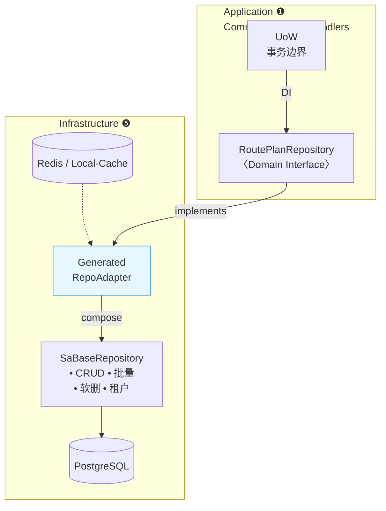
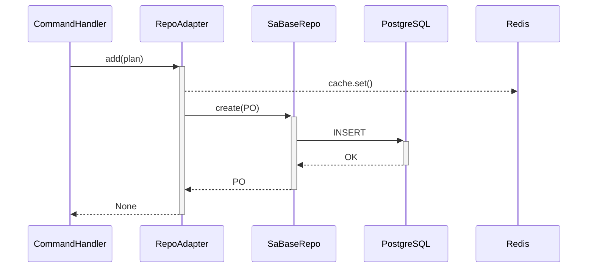
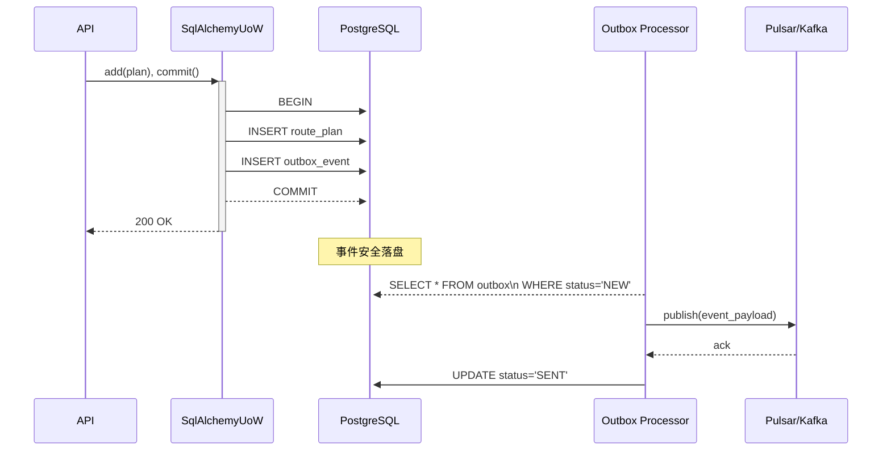
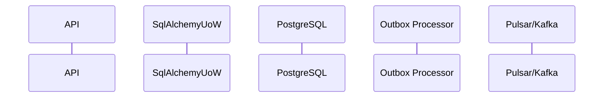

## 统一仓储框架设计方案  
*面向 FastAPI + SQLAlchemy 2.0 (Async)；目标：**几乎零样板**、强封装、可观测、易演进。*  

---

### 1 整体分层与依赖  

* **依赖单向**：上→下；业务永不见技术 API。  
* **胖** (`SaBaseRepository`)：横切逻辑一次实现；  
  **瘦** (接口 + 生成 Adapter)：业务只写语义查询。

---

### 2 生成器驱动的开发流

| 步骤 | 开发者输入 | `idp-gen` 自动输出 |
|------|-----------|--------------------|
| ① 定义聚合根 | `class RoutePlan` | — |
| ② 定义 PO + `@mapper` | `class RoutePlanPO` | — |
| ③ 声明接口 | `class RoutePlanRepository` | — |
| ④ 运行 `idp-gen repo RoutePlan` | — | `RoutePlanRepositoryImpl` - 绑定映射函数 - 注入缓存/租户装饰 - 带 `add/get/remove` & `_list_by_spec` |
| ⑤ **仅补业务 finder** | `find_ready()` ≈ 10 行 | — |

> 常规增删查 & Spec 查询全部自动生成；业务方 **代码行数 ≈ 25 %**。

---

### 3 运行时时序  

* **装饰器链顺序**：`@cache → @multitenant → @audited` 由元类固定。  
* 事务提交 & 领域事件派发由 UoW 统一处理。

---

### 4 关键组件说明  

| 组件 | 主要职责 | 可扩展点 |
|------|----------|----------|
| **SaBaseRepository** | - CRUD / 批量 - 软删除 / 多租户 / 乐观锁 - `find_by_spec`→SQL | Decorator：缓存、审计、OTel Span |
| **RepoAdapter\<PO, AR>** | - 组合 BaseRepo - 注入映射函数 - 实现接口的公共方法 | `_list_by_spec()` 分页 / 排序 |
| **Specification** | 同时产出 `is_satisfied_by` 与 SQLAlchemy 表达式 | 组合 `& | ~`、DSL |
| **代码生成器** | 读取 `@mapper` / 接口 输出 Adapter + stub finder | 支持增量 merge、生成 docs |

---

### 5 优势与量化收益  

| 指标 | 成本对比 | 说明 |
|------|----------|------|
| **仓储样板行数** | *传统* ≈ 100 → **本方案** ≈ 25 | -75 % |
| **业务泄漏风险** | BaseAPI 暴露 → **0** | Adapter 隐藏胖 API |
| **新增聚合耗时** | 0.5 d → < 1 h | CLI 一键生成 |

---

### 6 风险 & 缓解  

| 风险 | 等级 | 对策 |
|------|------|------|
| 生成代码冲突 | ⚠ | `# region custom` + CI 检查 |
| 复杂 JOIN 难封装 | ⚠ | 允许 `@sql` 或单独 Read-DAO |
| Decorator 顺序错误 | ⚠ | 元类固定链；框架测试覆盖 |
| 新人学习曲线 | ⚠ | Wiki + 示例仓储 + VSCode Snippet |

---

### 7 落地 Checklist

1. **集成 pre-commit**  
   * 修改接口 / PO → 自动再生成 Adapter，格式化 Black & ruff。  
2. **DI 容器仅暴露接口实现**  
   * 禁止 Application import `sa_base_repository`（flake8-banned-imports）。  
3. **测试战略**  
   * Domain 单测：FakeRepository  
   * Adapter + BaseRepo：Testcontainers PostgreSQL  
4. **监控**  
   * BaseRepo 内置 OpenTelemetry；Prometheus exporter 采样 SQL RTT & Cache 命中率。  

---

### 8 结论  
* 厚度在底层、接口在顶层，**封装 & 效率** 同时达到：  
  * **业务团队** —— 聚焦领域模型与极少量查询；  
  * **框架团队** —— 统一迭代横切能力、运维观测；  
  * **系统** —— 依赖清晰、类型安全、易测试、易演进。  

---

> 若需：  
> ① 生成器 (`click + jinja2`) 示例 ② `@mapper` & Decorator 实现 ③ 多租户过滤 / 缓存混入代码  
> — 请告诉我！

---

### 9 事件驱动架构

---

### 10 事件驱动架构

