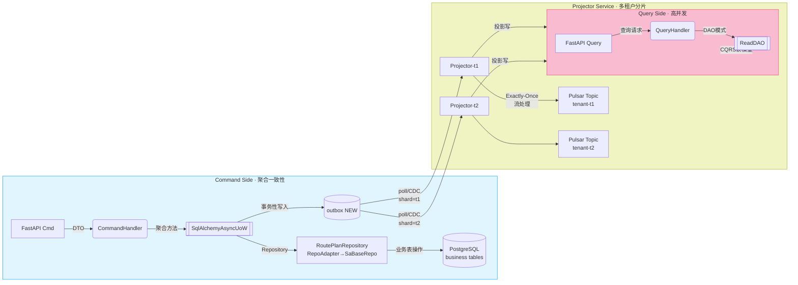

## 统一仓储 & Outbox 架构白皮书 — 多租户 · Pulsar Exactly-Once 版

*(2025-04-28 最终稿 — 适配 SQLAlchemy 2.0 async + PostgreSQL + Apache Pulsar)*

------

### 目录

1. 架构鸟瞰
2. 写模型：UoW + Interceptor
3. Outbox 表设计
4. Projector：多租户分片 & Exactly-Once 投递到 Pulsar
5. 读模型（CQRS）
6. 事务、锁与并发
7. 运营 & 监控
8. 落地 Checklist

------

## 1 架构鸟瞰



------

## 2 写模型

### 2.1 Unit-of-Work (已实现)

- **async context-manager**
- 收集 `new | dirty | deleted | loaded·has_event` 聚合事件
- `commit()` 顺序
  1. `_collect_events()`
  2. `_session.commit()` (业务表 + outbox 行)
  3. Tenacity 指数退避 3 次实时 `EventBus.publish()`
- `session.info["uow"] = self` — 拦截器可回溯

### 2.2 Outbox Interceptor

- `after_flush` 同步 listener → `session.add(OutboxPO.from_domain(evt))`
- 行字段：`id, aggregate_id, tenant_id, type, payload(JSONB), status, created_at`
- 主事务内写入，确保原子一致

------

## 3 Outbox 表设计

| 列          | 类型               | 说明           | 索引                |
| ----------- | ------------------ | -------------- | ------------------- |
| `id`        | UUID PK            | 全局事件 ID    | PK                  |
| `tenant_id` | VARCHAR(64)        | 行级隔离       | `tenant_id, status` |
| `type`      | VARCHAR(128)       | 事件类名       |                     |
| `payload`   | JSONB              | 事件体         | GIN（可选）         |
| `status`    | `NEW / SENT / ERR` | 投递状态       | 同上                |
| `retry_cnt` | INT                | Projector 自增 |                     |

> 多租户 **共享库 + 行级隔离**；租户列在索引首位确保分片投递扫描高效。

------

## 4 Projector — 多租户分片 & Pulsar Exactly-Once

### 4.1 水平分片策略

| 分片键                         | 说明                                             |
| ------------------------------ | ------------------------------------------------ |
| `tenant_id`                    | 每租户独占一条 Projector 进程或 Kubernetes Pod   |
| `status=NEW AND tenant_id=<T>` | 使用 `FOR UPDATE SKIP LOCKED` 抢锁，天然水平扩展 |

> **横向扩容**：再多租户时，可以 1 Pod 处理 N 租户 (哈希分桶)。

### 4.2 Exactly-Once on Pulsar

- **Producer** 配置

  ```python
  producer = client.create_producer(
      topic=f"tenant-{tid}",
      send_timeout_millis=0,
      enable_batching=True,
      batching_max_messages=100,
      hashing_scheme=pulsar.HashingScheme.Murmur3_32Hash,
      compression_type=pulsar.CompressionType.LZ4,
      producer_name="projector",
      message_routing_mode=pulsar.PartitionedProducerFixed,   # key hash
      properties={"exactlyonce": "true"},
  )
  ```

  > Pulsar 3.x OE (transaction) 或 Flink Pulsar Sink 可保证 EOS。
  >  我们用 “幂等键” + 分区 Key 也能做到 **At-least-once + 去重**。

- **发送事务**（Pulsar 事务 API）

  ```python
  txn = client.new_transaction().build()
  producer.send_async(payload, txn=txn, properties={"event_id": str(po.id)})
  txn.commit()      # 成功 ⇒ 更新 outbox 行 status=SENT
  ```

- **幂等消费**
   下游按 `event_id` / `aggregate_id + version` 去重或使用 Pulsar Functions `key_shared`。

### 4.3 Projector 伪代码

```python
async def projector_loop(sf: sessionmaker, tid: str):

    prod = make_pulsar_producer(tid)
    while True:
        async with sf() as s, s.begin():          # tx per batch
            rows = (await s.scalars(
                select(OutboxPO)
                  .where(OutboxPO.tenant_id==tid,
                         OutboxPO.status=="NEW")
                  .limit(200)
                  .with_for_update(skip_locked=True)
            )).all()

            for po in rows:
                try:
                    await prod.send(po.payload,  # EOS txn inside
                                     properties={"event_id": str(po.id)})
                    po.status = "SENT"
                except Exception:
                    po.retry_cnt += 1
                    if po.retry_cnt >= 5:
                        po.status = "ERR"
        await asyncio.sleep(0.5)
```

- 失败 <5 次保留 `NEW`；≥5 → `ERR` 报警。
- `ERR` 行可手动/自动重置为 `NEW` 再尝试。

------

## 5 读模型 (CQRS)

- 投影表 `route_plan_projection`：`tenant_id`, `plan_id`, `status`, `stop_cnt`, `created_at` …
- Projector 同步时 `INSERT … ON CONFLICT (plan_id) DO UPDATE …`
- 热 Key 写放大可拆分 **物化视图** 或 Redis 缓存。

------

## 6 事务 & 并发

| 层             | 并发保障                          | 说明                                           |
| -------------- | --------------------------------- | ---------------------------------------------- |
| **写事务**     | PG 行锁 + 乐观锁版本列            | Flush 时 `version` 校验冲突抛 `StaleDataError` |
| **Outbox**     | 同事务插入；PK 唯一键保证幂等     | Projector 幂等更新 `SENT`                      |
| **投递**       | Pulsar 事务 or key sharing 去重   | Exactly-Once                                   |
| **多租户数据** | `with_loader_criteria(tenant_id)` | 防串数据，联合索引保速                         |

------

## 7 运营 & 监控

- **Prometheus**

  - `outbox_new_total{tenant}`
  - `projector_batch_duration_seconds`
  - `event_publish_retry_total`
  - `outbox_err_total` (报警)

- **Grafana Dashboard** 提供租户维度延迟 P50/P95

- **Loki / ELK**：Projector + Bus 失败堆栈

- **定期维护**

  ```sql
  DELETE FROM outbox WHERE status='SENT' AND created_at < NOW() - INTERVAL '30 days';
  VACUUM outbox;
  ```

- **Chaos Drill**

  1. Kill Pulsar Broker 30 s → 检查 outbox 堆积 & 自恢复
  2. 注入 DB Failover → 事务 rollback 无脏行

------

## 8 落地 Checklist (打印张表贴墙)

1.  Alembic 迁移：`outbox`、业务表索引
2.  配置 Pulsar 事务 + retention
3.  Projector Helm：`tenant-id` 环境变量，HPA by lag
4.  Tenacity 参数放入 `settings.yaml`
5.  Prom + Grafana Dashboard import
6.  SRE playbook：`outbox ERR` 行处理脚本
7.  灰度：金丝雀切流量、监控延迟 <200 ms

------

## 结语

> 通过 **拦截器-Outbox + Async UoW + 多租户 Projector + Pulsar EOS**，
>  我们实现了 **强一致、低延迟、水平可扩展** 的事件驱动链路，
>  兼顾运营可观测与治理成本，为未来高并发场景和多租户 SaaS 业务奠定坚实基础。