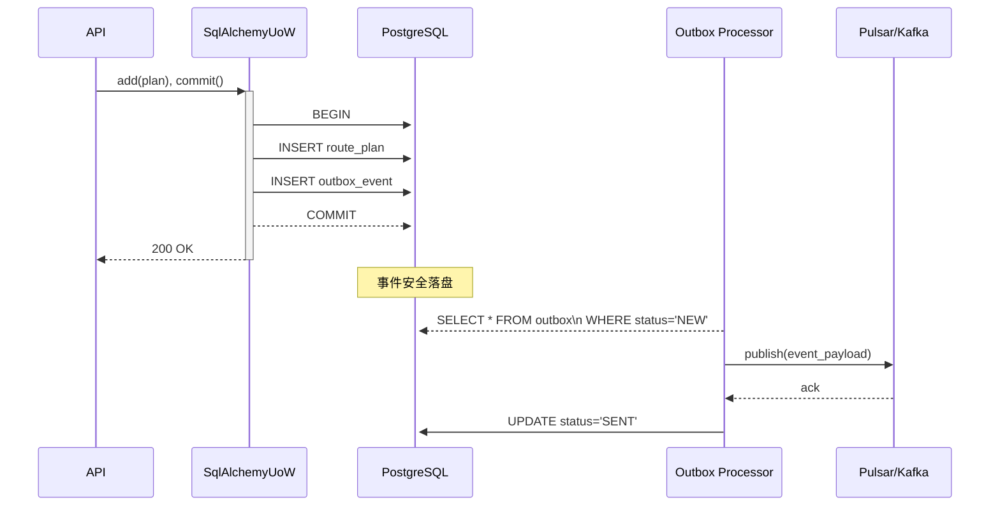

```mermaid
sequenceDiagram
    participant API
    participant UoW as SqlAlchemyUoW
    participant DB as PostgreSQL
    participant OutboxP as Outbox Processor
    participant MQ as Pulsar/Kafka

    API->>+UoW: add(plan), commit()
    UoW->>+DB: BEGIN
    UoW->>DB: INSERT route_plan
    UoW->>DB: INSERT outbox_event
    UoW-->>DB: COMMIT
    UoW-->>-API: 200 OK
    Note over DB: 事件安全落盘

    OutboxP-->>DB: SELECT * FROM outbox\n WHERE status='NEW'
    OutboxP->>MQ: publish(event_payload)
    MQ-->>OutboxP: ack
    OutboxP->>DB: UPDATE status='SENT'
```
