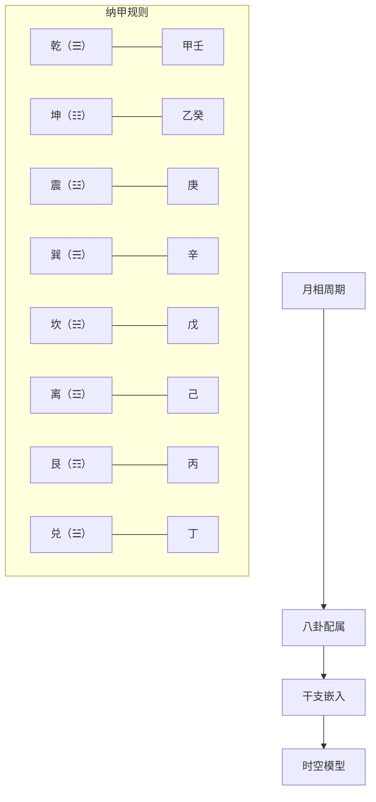
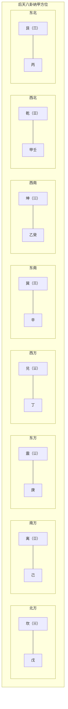
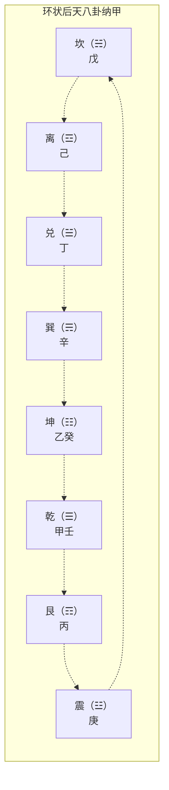

```mermaid
graph TB
A[月相周期] --> B[八卦配属]
B --> C[干支嵌入]
C --> D[时空模型]

subgraph 纳甲规则
    乾["乾（☰）"] --- 甲壬["甲壬"]
    坤["坤（☷）"] --- 乙癸["乙癸"]
    震["震（☳）"] --- 庚["庚"]
    巽["巽（☴）"] --- 辛["辛"]
    坎["坎（☵）"] --- 戊["戊"]
    离["离（☲）"] --- 己["己"]
    艮["艮（☶）"] --- 丙["丙"]
    兑["兑（☱）"] --- 丁["丁"]
end

```

```mermaid
graph TB
subgraph 后天八卦纳甲方位
    subgraph 北方
        KAN["坎（☵）"] --- WU["戊"]
    end
    
    subgraph 南方
        LI["离（☲）"] --- JI["己"]
    end
    
    subgraph 东方
        ZHEN["震（☳）"] --- GENG["庚"]
    end
    
    subgraph 西方
        DUI["兑（☱）"] --- DING["丁"]
    end
    
    subgraph 东南
        XUN["巽（☴）"] --- XIN["辛"]
    end
    
    subgraph 西南
        KUN["坤（☷）"] --- YIGUI["乙癸"]
    end
    
    subgraph 西北
        QIAN["乾（☰）"] --- JIAREN["甲壬"]
    end
    
    subgraph 东北
        GEN["艮（☶）"] --- BING["丙"]
    end
end

```

```mermaid
graph LR
    subgraph 环状后天八卦纳甲
        KAN["坎（☵）<br/>戊"] 
        LI["离（☲）<br/>己"]
        ZHEN["震（☳）<br/>庚"]
        DUI["兑（☱）<br/>丁"]
        XUN["巽（☴）<br/>辛"]
        KUN["坤（☷）<br/>乙癸"]
        QIAN["乾（☰）<br/>甲壬"]
        GEN["艮（☶）<br/>丙"]
        
        KAN -.-> LI
        LI -.-> DUI
        DUI -.-> XUN
        XUN -.-> KUN
        KUN -.-> QIAN
        QIAN -.-> GEN
        GEN -.-> ZHEN
        ZHEN -.-> KAN
    end
```
