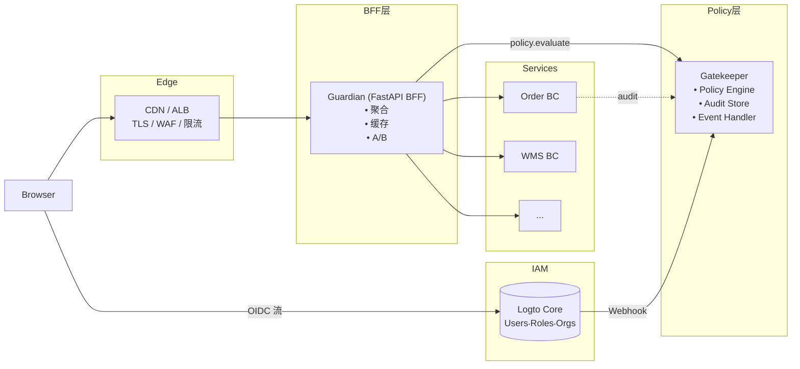
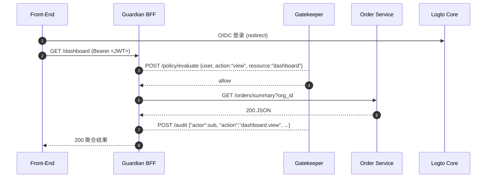

下面给出 **“Guardian BFF × Gatekeeper 策略中心 × Logto 身份基座”** 的 **完整解决方案**。
内容按 **架构蓝图 → 职责划分 → 交互流 → 目录与代码骨架 → 运行时配置 → CI/CD → 可观测 & 运维** 七大块展开，确保你能在现有 DDD Framework 中直接落地。

---

## 1 总体架构蓝图



---

## 2 职责划分

| 层次                 | 核心职责                                                                                | 关键技术                         |
| ------------------ | ----------------------------------------------------------------------------------- | ---------------------------- |
| **Edge (CDN/ALB)** | TLS 终端、IP 限流、静态资源                                                                   | 云厂商/Ingress                  |
| **Guardian (BFF)** | ① 聚合多微服务数据<br>② 字段裁剪、分页、降维<br>③ 热门接口 L1/L2 缓存<br>④ A/B / 灰度<br>⑤ 转发权限请求到 Gatekeeper | FastAPI + httpx + cachetools |
| **Gatekeeper**     | ① `policy.evaluate` 决策<br>② `audit.write` 聚合<br>③ 处理 Logto Webhook & 业务 Event       | FastAPI + OPA/自研 DSL         |
| **微服务 (BC)**       | 领域模型 & Use-Case；信任 BFF 注入的 Principal                                                | DDD + SQLAlchemy             |
| **Logto**          | Login UI，用户／角色／组织，多租户，SSO，Secret Vault                                              | v 1.30.1                     |

---

## 3 核心交互序列



---

## 4 目录与代码骨架

```
monorepo/
├─ libs/
│   ├─ auth_logto/           # JWT 验签 (已实现)
│   ├─ gatekeeper_client/    # **NEW** 封装 GK API
│   └─ guardian_sdk/         # **可选** 前端 TypeScript 客户端
├─ services/
│   ├─ guardian/
│   │   ├─ main.py
│   │   ├─ routes/
│   │   │   ├─ dashboard.py
│   │   │   └─ orders.py
│   │   └─ adapters/         # 调各 BC http/gRPC
│   ├─ gatekeeper/
│   │   ├─ main.py
│   │   ├─ application/
│   │   │   ├─ policy_service.py
│   │   │   └─ audit_service.py
│   │   └─ infrastructure/
│   │       └─ logto_mgmt.py
│   └─ order_bc/
│       └─ ...
└─ helm/
    ├─ guardian/
    ├─ gatekeeper/
    └─ values-prod.yaml
```

### 4.1 gatekeeper\_client

```python
# libs/gatekeeper_client/__init__.py
class GatekeeperClient:
    def __init__(self, base_url: str, timeout=3):
        self.base = base_url.rstrip("/")

    async def evaluate(self, principal: dict, action: str, resource: str):
        r = await httpx.post(f"{self.base}/policy/evaluate",
                             json={"principal": principal,
                                   "action": action,
                                   "resource": resource}, timeout=3)
        r.raise_for_status()
        if not r.json().get("allow"):
            raise PermissionError("policy denied")

    async def audit(self, event: dict):
        try:
            await httpx.post(f"{self.base}/audit", json=event, timeout=2)
        except httpx.HTTPError:
            # 审计失败不影响主流程
            pass
```

### 4.2 Guardian 路由示例

```python
# services/guardian/routes/dashboard.py
router = APIRouter()

@router.get("/dashboard")
async def dashboard(user=Depends(CurrentUser),
                    gk: GatekeeperClient = Depends(get_gk),
                    order=Depends(get_order_client)):
    await gk.evaluate(user.dict(), "view", "dashboard")

    orders, stock = await asyncio.gather(
        order.last7days(user.org_id),
        order.stock_summary(user.org_id)
    )
    data = DashboardVM(orders=orders, stock=stock)

    await gk.audit({
        "actor": user.id, "org": user.org_id,
        "action": "dashboard.view", "status": "success"
    })
    return data
```

### 4.3 Gatekeeper Policy Service（示例用 OPA Rego / 可替换 DSL）

```python
# application/policy_service.py
from opa import OpaClient

class PolicyService:
    def __init__(self):
        self.opa = OpaClient(url=os.getenv("OPA_URL"))

    async def evaluate(self, principal: dict, action: str, resource: str) -> bool:
        input_data = {"user": principal, "action": action, "resource": resource}
        res = await self.opa.query("data.policy.allow", input_data)
        return res.get("result", False)
```

---

## 5 运行时配置（ENV）

```bash
# 共用
LOGTO_ENDPOINT=https://auth.acme.io
LOGTO_API_AUD=https://api.acme.io

# Guardian
GK_BASE_URL=http://gatekeeper:8000
CACHE_TTL_SECONDS=10

# Gatekeeper
LOGTO_M2M_ID=svc-gk
LOGTO_M2M_SECRET=••••
OPA_URL=http://opa:8181
```

---

## 6 CI/CD 流程

| 阶段           | Guardian                                                    | Gatekeeper                                  |
| ------------ | ----------------------------------------------------------- | ------------------------------------------- |
| **Unit**     | pytest + httpx Mock                                         | pytest + opa test                           |
| **Build**    | `docker build -t guardian:$SHA .`                           | 同上                                          |
| **E2E**      | Playwright：Login→GET /dashboard                             | 调 `/policy/evaluate` & `/audit`             |
| **Deploy**   | `helm upgrade guardian ./helm/guardian -f values-prod.yaml` | `helm upgrade gatekeeper ./helm/gatekeeper` |
| **Rollback** | `helm rollback guardian n-1`                                | 同                                           |

---

## 7 可观测 & 运维

| 维度          | Guardian                              | Gatekeeper                                 |
| ----------- | ------------------------------------- | ------------------------------------------ |
| **Metrics** | `bff_cache_hit`, `bff_agg_latency_ms` | `policy_denied_total`, `audit_saved_total` |
| **Trace**   | span `guardian.aggregate.orders`      | span `gatekeeper.policy.evaluate`          |
| **日志**      | 结构化 JSON；trace\_id                    | 同步 trace\_id 方便跨服务检索                       |
| **灾备**      | 无状态，镜像 + Helm                         | `audit_event` PostgreSQL 定期备份              |

---

## 8 安全与故障策略

1. **Guardian 缓存失效** ➜ 透传实时聚合；可降级只返回关键子模块。
2. **Gatekeeper 不可用** ➜ Guardian fallback 仅看 JWT scope（短时）；同时告警。
3. **Logto Webhook 失败** ➜ Gatekeeper 将事件放入重试表 (`retry_count`, `next_try_at`)。
4. **M2M Token 过期** ➜ `gatekeeper.infrastructure.logto_mgmt` 内部自动刷新并 TTL 缓存。

---

### 完成标志（Checklist）

* [ ] `/dashboard` 首屏接口只打 Guardian；后端调用次数 ≤ 2。
* [ ] 禁用某用户 Scope，`policy.evaluate` 返回 deny，前端拿到 403，Guardian 记录 audit。
* [ ] Grafana 仪表板能看到 `policy_denied_total` 曲线。
* [ ] Helm 滚动升级 Gatekeeper 不影响正在进行的 Dashboard 请求。

---

## 9 下一步可扩展

* **GraphQL Mesh**：Guardian 用 Apollo Federation 把 REST 聚合成单一 GraphQL。
* **边缘函数**：将简单缓存接口迁到 CDN Edge Worker，Guardian 只处理重逻辑聚合。
* **多 BFF**：移动端另起一个 Guardian-Mobile，共享 Gatekeeper。
* **策略 DSL**：把 OPA Rego 换成 YAML DSL + Web GUI，让非技术同事管理授权。

---

> **总结**
> 通过 **Guardian（前端专属 BFF） + Gatekeeper（策略&审计） + Logto（身份基座）** 的三层组合：
>
> * 前端开发只关心 **Guardian** 的聚合 JSON，极速迭代；
> * 全局授权逻辑集中在 **Gatekeeper**，规则改动无需动微服务；
> * **Logto** 继续负责登录、用户、角色、租户与 SSO。
>
> 如需 **完整 FastAPI 项目模板**、**Helm chart 示例** 或 **OPA Rego 规则样板**，随时告诉我！
